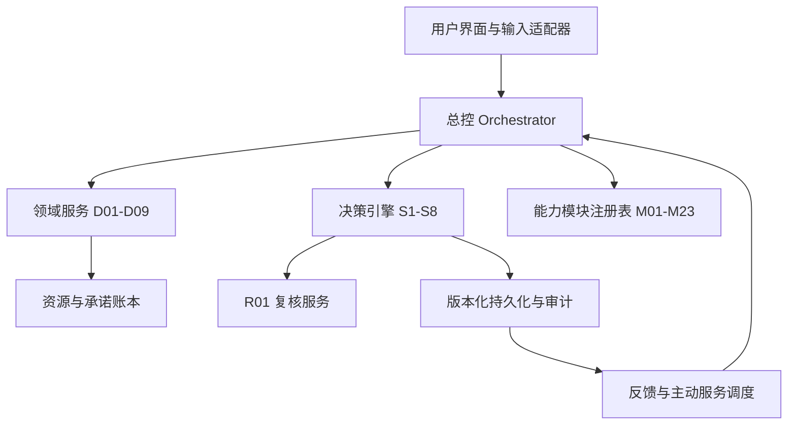

# 系统架构设计

## 1. 总体结构

## 2. 分层

### 表现层

Web 或桌面界面只展示当前目标、下一步行动、待处理变化和需要用户取舍的事项。复杂证据、复核意见和跨域影响按需展开。第一阶段可使用本地 Web UI。

### 应用层

`Orchestrator` 负责识别问题范围、建立状态快照、选择阶段、派发能力模块、汇总结果、检查授权、生成用户可理解的输出，并维护流程回退。

### 领域层

领域服务维护 D01-D09 的状态和接口；决策引擎维护 S1-S8；资源服务统一核算时间、资金、精力、承诺和缓冲；执行服务维护行动、重试、停止和验收；复核服务执行 R01 规则。

### 能力层

23 个模块以注册表方式存在，每个模块提供结构化输入输出。逻辑、科学方法、证据、统计、系统与控制属于跨阶段基础能力；健康、法律、财务等模块必须声明风险边界。

### 基础设施层

关系数据库保存核心实体和版本；对象存储保存用户主动上传的文件；任务队列负责延迟反馈和主动检查；审计日志保存所有关键变化；模型网关统一管理提示、模型、费用和脱敏。

## 3. 数据流

1. 用户输入或授权来源产生原始事件。
2. 摄取层保存原始内容、来源和时间，不直接覆盖事实。
3. 抽取层将内容转成候选事实、计划、观察或问题，并标注置信度。
4. 用户确认或规则验证后写入证据账本和状态快照。
5. 总控识别受影响领域、资源和当前决策阶段。
6. 决策引擎按需调用能力模块生成阶段产物。
7. R01 复核后，系统向用户呈现建议、未知、取舍和反转条件。
8. 用户选择后，执行服务生成行动；只有在授权范围内才调用外部工具。
9. 观察和用户确认结果进入反馈层，必要时使旧决策过期并回退到受影响阶段。

## 4. 关键一致性设计

- 所有影响判断的对象带版本：目标、约束、证据、方案、资源快照和用户选择。
- 决策结果保存依赖版本；依赖变化自动标记旧结果 `stale`。
- 资源核算使用统一周期、单位和币种；共享行动通过唯一 ID 去重。
- 计划、观察行为、用户确认结果分成不同事件类型。
- 状态机禁止从 `unknown` 直接推导 `not_started` 或 `completed`。
- 外部副作用采用幂等键和执行回执；回执缺失时执行状态仍为未知。

## 5. MVP 边界

第一版只做：单用户、本地数据库、自然语言/表单输入、目标与约束、证据账本、S1-S8 记录、硬约束与共享资源核算、R01 复核清单、行动计划、手工反馈、导出和审计。

第一版不做：全量电脑行为采集、默认读取定位/通讯录/健康/财务、自动发送消息、自动交易、医疗诊断、法律结论、复杂多智能体常驻、面向多人协作和计费系统。

