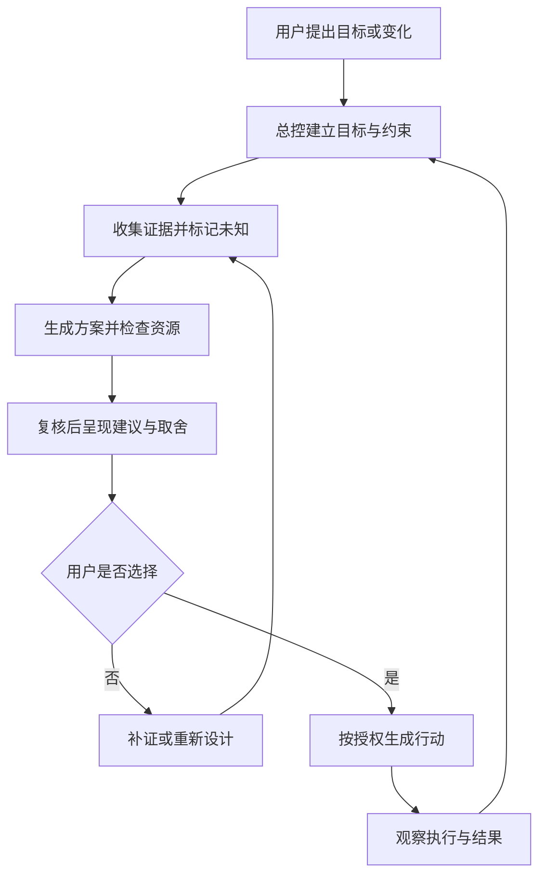

# 系统需求说明

## 1. 用户与场景

首个用户是希望在有限资源下推进复杂目标的人，首个验证场景为在职职业转型。用户可以用自然语言、语音转写、文件或表单输入目标；系统只追问会改变当前判断的缺失信息。

## 2. 功能模块

### F01 身份与个人空间

支持单用户账户、工作区、时区、语言、数据导出、删除和恢复。不同用户数据必须严格隔离。

### F02 目标与约束

记录愿望、可验收目标、期限、优先级、硬约束、软偏好、固定承诺和允许动作，并支持版本化。

### F03 状态与证据账本

保存事实、来源、采集时间、可靠性、适用范围、冲突记录、未知项和用户确认状态。缺失不是零值。

### F04 决策引擎

按 S1-S8 推进，可回退到受影响阶段。输出阶段产物、调用的能力模块、证据、假设、未知、反对意见、建议和反转条件。

### F05 总控与跨领域协调

识别受影响领域，汇总共享时间、资金、精力和承诺；生成可行组合，报告冲突，并提供缩减、替换、延期或不启动方案。

### F06 行动与执行

把用户选择拆为行动；每个行动有主责、依赖、授权、预算、截止时间、验收标准、停止条件和效果时点。实际执行状态必须独立记录。

### F07 主动服务

根据明确授权的来源进行定时检查、变化检测、必要补问和提醒。支持安静时段、提醒上限、暂停同步和撤销授权。

### F08 复盘与效果评估

比较预测、计划、观察行为、用户确认结果和实际代价；区分判断错误、执行偏差、环境变化和偶然性。系统正确性与生活效果分层评估。

### F09 能力模块注册表

能力模块按需调用，不常驻。每个模块声明适用问题、输入、输出、证据要求、禁止推断和成本。

## 3. 用户流程

## 4. 核心数据结构

- `UserProfile`: `id`, `timezone`, `preferences`, `consent_version`。
- `ValuePolicy`: `id`, `values`, `directions`, `hard_boundaries`, `version`, `valid_from`, `valid_to`。
- `LifeDomain`: `id` D01-D09, `name`, `desired_state`, `current_state`, `unknowns`, `metrics`。
- `Goal`: `id`, `domain_ids`, `statement`, `acceptance_criteria`, `deadline`, `priority`, `status`, `version`。
- `Constraint`: `id`, `kind`, `resource_type`, `limit`, `unit`, `currency`, `hardness`, `source`, `validity`。
- `Evidence`: `id`, `claim`, `source_type`, `source_ref`, `observed_at`, `reliability`, `scope`, `user_confirmed`, `version`。
- `Decision`: `id`, `stage`, `goal_version`, `evidence_version`, `option_version`, `resource_snapshot_id`, `recommendation_status`, `choice_status`, `execution_status`, `stale_reason`。
- `Option`: `id`, `decision_id`, `description`, `requirements`, `benefits`, `costs`, `risks`, `reversibility`, `scenarios`, `hard_constraint_result`。
- `Action`: `id`, `decision_id`, `owner`, `authorized_scope`, `dependencies`, `planned_at`, `due_at`, `acceptance_criteria`, `stop_conditions`, `execution_status`。
- `ResourceLedger`: `id`, `period`, `resource_type`, `capacity`, `reserved`, `committed`, `used`, `unit`, `currency`, `source`。
- `Review`: `id`, `decision_id`, `reviewer`, `objections`, `counterexamples`, `missing_evidence`, `cross_domain_effects`, `status`。
- `Observation`: `id`, `action_id`, `observed_behavior`, `user_confirmed_result`, `observed_at`, `effect_due_at`, `source`, `confidence`。

## 5. 接口设想

- `POST /api/v1/goals` 创建目标。
- `GET /api/v1/state/snapshot` 获取当前问题所需的有限状态快照。
- `POST /api/v1/decisions` 创建决策并运行当前阶段。
- `POST /api/v1/decisions/{id}/advance` 推进阶段。
- `POST /api/v1/decisions/{id}/review` 请求 R01 复核。
- `POST /api/v1/decisions/{id}/choose` 记录用户选择。
- `POST /api/v1/actions` 创建行动计划。
- `POST /api/v1/actions/{id}/observations` 写入执行观察或用户确认结果。
- `GET /api/v1/resources/conflicts` 查询跨领域资源冲突。
- `POST /api/v1/consents` 创建、暂停或撤销数据源授权。
- `GET /api/v1/audit/{entity_type}/{id}` 查询版本和审计轨迹。

所有接口需支持幂等键、分页、时区、版本校验和审计事件。外部连接器应通过适配器隔离，第一阶段只实现本地文件和手工输入；日历、任务、邮件、消息等连接器后续按授权接入。

