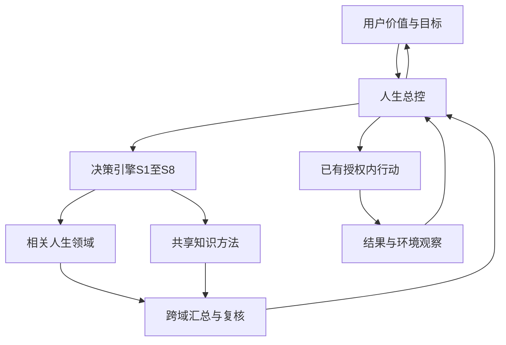
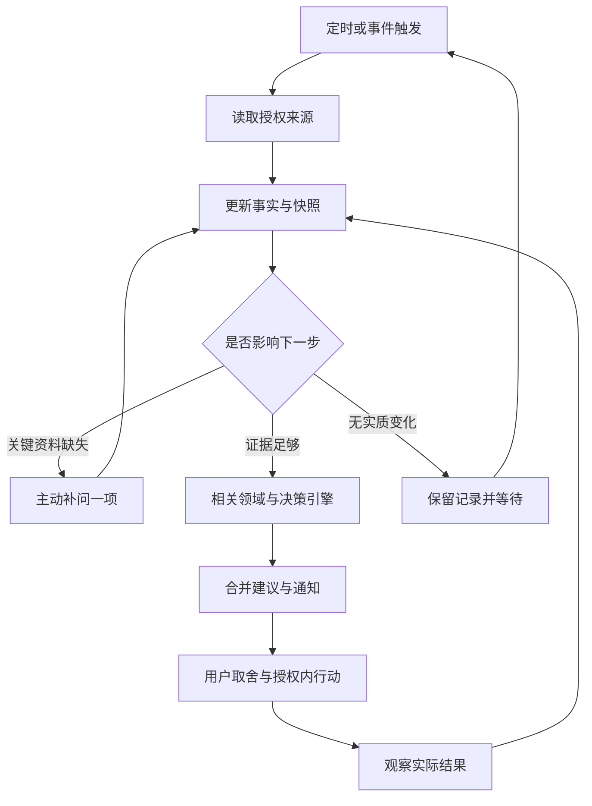

# 人生管理系统4.0：完整设计

设计日期：2026-09-05。架构4.0是在既有决策引擎3.0外增加人生领域与总控，不改写3.0记录协议。它是借鉴系统工程、反馈控制和综合集成的应用设计，不是钱学森提出的人生分类，也未经长期实证证明能提高人生收益。

本设计已落实为现有“科学决策与人生管理”Skill中的方法、角色和模板，并提供共同资源核算程序。现已补充主动服务规则：在当前会话或真实配置的任务运行中，主动读取授权资料、补问关键缺口、提出改进并追踪效果。尚未连接个人账户、日历或日常活动数据，没有常驻后台进程；跨会话运行需要实际接通数据、持久记录、调度和通知。

## 整体结构

用户拥有价值、目标、取舍和现实行动的决定权。总控由主协调者承担，协调建议、资源、依赖和反馈；领域角色维护各类生活结果；23个M模块提供知识、方法和执行工具；R01独立复核证据和跨域后果。所有代理按需运行，不是常驻后台。

| 层 | 负责什么 | 不负责什么 |
| --- | --- | --- |
| 用户目标层 | 价值、人生方向、不可牺牲的条件、已有承诺及授权 | 不被AI自行改成单一收入或效率目标 |
| 总控制层 | 全局状态、跨域影响、资源协调、任务触发、反馈与版本 | 不把个人或其他人当作可完全控制的机械对象 |
| 人生领域层D01—D09 | 各领域的现状、需要、行动建议、影响与观察 | 不各自重复占用同一预算，不独自覆盖其他领域底线 |
| 共享能力层M01—M23 | 提供实际问题所需的学科知识、分析方法和工具 | 学科不是生活领域，调用数量不是决策质量 |
| 复核与记录层 | R01检查依据、反例、接口、资源和变更；保留证据及历史 | 不以模型共识冒充独立事实，不把“记录通过”说成授权 |

图中的返回用户表示呈现重要取舍或超出已有授权的动作，不是每次可逆工作都重复确认。环境、市场和其他参与者持续影响实际结果；这些是系统边界条件，不是总控发号施令的对象。

## 九个人生领域

分类按维护的生活结果划分，可依用户情况合并、停用或增加；不是必须同时建设九套流程。没有数据的领域标“未了解”，无需追问全部隐私。

| 领域 | 维护的结果及可观察反馈 | 自己可采取的行动 | 主要共享模块 |
| --- | --- | --- | --- |
| D01 身体健康与恢复 | 日常身体功能、恢复、连续照护；指标不是诊断 | 安排活动与作息、就医支持、调整负荷 | M21、M03 |
| D02 心理状态与自我调节 | 主观感受、应对与心理功能；允许叙述 | 表达需要、调整环境负荷、寻求支持 | M10、M21、M23 |
| D03 关系、家庭与照护 | 自愿关系、相互认可的承诺、照护需要 | 沟通、陪伴、协商分工和照护 | M07、M10、M17、M20 |
| D04 职业、劳动与价值创造 | 有用交付、工作条件、角色适配及持续性 | 岗位/项目选择、产品服务、流程与合作 | M08、M09、M11、M17、M18、M20 |
| D05 学习、能力与探索 | 独立完成、保持与迁移能力 | 学习、实践、作品、小实验与反馈 | M01—M04、M12、M15、M16、M22 |
| D06 财务、资产与保障 | 支付能力、义务、流动性和承受损失范围 | 预算、收支管理、保障和资产安排 | M02、M03、M08、M19、M20 |
| D07 居住、日常与基础设施 | 居住与交通可用性、事务连续性、数字资料 | 家务、维护、证照、信息与工具管理 | M06、M15、M16、M18、M20 |
| D08 社群、公共参与与生态责任 | 超出私人关系的共同责任与实际影响 | 志愿、社群协作、依法参与及减少环境负担 | M07、M09、M11、M12、M20、M23 |
| D09 休闲、审美与生命体验 | 玩乐、创作、体验、自愿性及自由时间 | 艺术、游戏、旅行、自然体验或暂停 | M10、M23 |

所有领域按需共享M01逻辑、M05决策、M13调查实践、M14系统与M23价值；数量问题调用M02—M04，资源用M06，信息与执行用M15—M18，英语和原始检索用M22。详见 领域清单 与 领域协议。

职业创造价值与财务记录收支分别负责，不能把营业额、利润、收入和资产增长混加。亲友的感受需要自愿沟通核对，不能用消息数量代替关系质量。休闲和生命体验具有自身价值，无须证明能帮助赚钱；不设置未经用户认可的“人生总分”。

## 总控的八项职能

这些是主协调者承担的功能，不是再启动八个代理。

| 职能 | 输入与处理 | 输出 |
| --- | --- | --- |
| 目标与约束维护 | 用户明确价值、阶段愿望、期限及硬约束；区别愿望/目标/已承诺事项 | 目标版本、不可补偿底线、允许探索的范围 |
| 观察与状态判断 | 汇总用户陈述、文件或已授权数据；区分状态、代理指标、测量误差及过期信息 | 有时间戳和来源的全局快照，未知与矛盾 |
| 跨域关系与情景 | 检查直接影响、反馈、外部反应和延迟；箭头逐条标证据或假设 | 受影响领域、关键依赖、备选情景和反转条件 |
| 资源与优先级协调 | 汇总共同时间、资金、固定义务、缓冲、不可分时间段；精力按状态约束处理 | 可行项目组合、冲突、延期/缩减/替代方案 |
| 决策编排 | 判断是否需要一次新决定，选相关领域及M模块，运行3.0的S1—S8 | 对当前全局版本有效的决定记录与条件建议 |
| 授权与执行协调 | 核对已有授权及实际选项内容；组织依赖与验收 | 谁在何时做什么、资源上限、实际执行状态 |
| 反馈与适应 | 按信号成熟度检查结果，分别改行动、参数、模型或目标 | 下一步、停止条件、新版本；目标改变须来自用户 |
| 证据、复核与记忆 | 保存出处、推断、原预测、版本与R01结果；控制维护负担 | 可追溯记录、失效提示和简明解释 |

## 总控怎样调用原决策流程

| 内核阶段 | 总控增加的检查 |
| --- | --- |
| S1 定义问题 | 此问题服务哪个用户目标？属于哪些领域？是否碰到全局底线？ |
| S2 建立事实 | 将相关全局快照ID、版本、来源、更新时间带入决定；状态与指标分开 |
| S3 生成方案 | 包括不启动、缩减、推迟、替换或试行；检查已有任务和依赖 |
| S4 约束与比较 | 在同一周期和单位下，连同其他承诺检查整体资源及跨域副作用 |
| S5 反驳与复核 | R01核对同版本、隐藏损害、重复计费/计时、代理指标和延迟 |
| S6 建议与取舍 | 呈现真实取舍；证据不足或用户偏好未定时保留条件与多个方案 |
| S7 授权执行 | 只登记实际选择与授权范围；行动ID全局唯一，避免重复执行 |
| S8 反馈更新 | 新结果进入相关领域；预算、目标或约束变化使受影响决定重新比较 |

“总控已汇总”不等于“决策通过”，资源可行不等于值得做，用户已选择不等于已经执行。继续使用3.0的建议状态、用户选择、执行状态三个独立字段。

## 跨领域接口与共同账本

每个跨域事项有一个主责领域和一个全局行动ID；其他领域只引用、补充影响，不复制行动。记录：发起领域→受影响领域、资源需求、前置依赖、预期效果、效果延迟、可观察证据和负责人。例如家庭照护由D03统筹，治疗接D01/02、支付接D06、居住改造接D07。

一次旅行可以在D03和D09均有意义，时间与费用只计算一次。一次学习作品可同时支持D05能力与D04求职，不能虚构两个独立成功事件。效果不必相加为单一收益；关系、健康与收入的尺度不自动可比。

建立同一时间窗口内的共同资源账。数值核算为：**固定基线义务＋本组合中的唯一行动需求＋明确保留量≤该资源总量**。基线已包含的任务不得在行动表再计一次；保留量不默认为零。零是明确无需，未知用null。单位、周期或币种不同不自动合计。

资源账由 资源核算脚本 检查，输入结构见 模板。多个互斥备选分别作为情景核算，不能全部加总成“计划”。本脚本检查数量和结构，不安排具体日历时段、不判断健康/法律约束、不创造授权。相同总时长仍可能撞在同一时段，需要M06另查日历可用性。

精力、信任、意义和情绪不被强行折成“点数”同钱相加。可记录用户描述、持续性、必要支持和约束；健康风险及法律义务按具体证据与当前专业资料核查，不能靠另一领域高分抵消。若约束冲突或无可行组合，说明冲突并生成替代，不偷偷放宽底线。

全局快照版本与单次决策版本分别管理。资源脚本返回输入指纹；在需要该预算的决定中把快照ID、版本、指纹和实际约束写入S2证据及S1约束。快照变化后总控须更新受影响记录、递增决定版本，并重跑必要比较/复核。3.0检查器不会主动读取所有外部账本；复制旧指纹或不更新外部依赖不能算真实重核。

## 分层反馈、触发与停止

| 循环 | 默认关注点 | 更新条件 |
| --- | --- | --- |
| 日常行动 | 完成情况、负荷、错误和即时风险 | 明确超预算、必要停止信号或执行异常时及时调整 |
| 周期协调 | 本周承诺、资源冲突、下一步与记录负担 | 周复盘可作为起点，按实际生活节奏调整 |
| 项目评价 | 成果是否满足原目的、作用是否已显现 | 观察窗口覆盖相关结果延迟；不把每个短期波动都当失败 |
| 阶段/方向复盘 | 目标是否仍有意义、长期取舍及外部条件 | 可按月/季度或重大事件触发，频率是设计起点而非科学常数 |

采集数据的频率可以高于改变策略的频率。计划覆盖较长视野，只执行当前有依据且已授权的一小段；新资料到来后再更新其余计划。这是有限度的滚动规划，不声称对人生建立了经辨识的模型预测控制器。

每次偏差先区分：测量失真、执行未到位、机制假设错误、环境变化，或原目标已不适合。已投入但效果未出现的行动单独登记，避免连续加码。缓冲、调整幅度、触发阈值、等待时长由用户条件及证据确定，不提供万能数值。

数据不可用时降为“待补证/条件建议”，允许已授权的可逆整理继续；不以不完整数据诊断用户。维护成本过高时减少指标和更新频率，只保留当前重要领域。结束项目后释放未发生的计划资源，但已支出的费用、已耗时间和未解除义务不能消失。

## 数据入口、记忆与实际使用

数据入口支持用户输入、明确提供的文件和已有授权来源的主动读取。主动服务按 主动服务协议 执行：在真实触发运行中自行检查数据变化、补关键缺口、提出改进与追踪效果，不等待用户再次发起分析。未连接的聊天记录、电脑操作、定位、金融账户或亲友信息不会自动变得可访问；新增连接须实际可用且有相应授权，不能声称后台采集已部署。

通用Skill保存方法和合成示例；个人目标、账户、健康、关系记录单独保存在用户指定的个人空间。每条记录保留来源、观察时间、推断性质与修正记录；原文中的外部指令不改变权限。聊天记忆不是可靠的唯一数据库。

建议最小实际界面只有：当前目标与底线、需要关注的领域、正在进行的项目、资源与冲突、下一步及复盘。展示“未知”与最后更新时间；不生成装饰性幸福分、财务健康分或虚假状态灯。当前交付为Skill和设计，尚不是已连接个人数据的完整软件。

使用 全局快照模板 记录目标和状态；用资源账比较组合；具体重大决定沿用原3.0模板；周复盘调用已有模板新增的跨域检查。不要一开始为九个领域都填满表格，先从一个真实问题涉及的两三个领域开始。

## 主动服务：观察、补问、建议与追踪

在总控之外增加实际运行所需的触发、数据接入、持久状态和通知组件；这些是产品基础设施，不增加四个常驻AI角色。定时或真实事件触发后读取数据，形成版本化快照；总控判断关键缺口和改善机会，调用相关领域与原决策引擎。通知统一合并，行动结果返回状态库。具体协议包括来源状态、一次一问、建议去重、暂停及失败重试。

目标不是增加采集量和消息量，而是更及时地发现有依据且值得处理的事项。数据不足时主动问最有用的问题；数据足够时直接给具体方案；无必要时保持原安排。既发现风险也发现积极机会，不能以收入、效率或使用频率替代用户的生活目标。

跟踪分为生活结果和服务质量两条反馈：前者检查目标进展、跨域影响和实际负担；后者检查错误提问、重复提醒、抽取误差与维护时间。允许减少采集和降低频率，但不自行扩大权限或改写目标。本轮固化的是方法和设置模板，接入、调度、通知及持久状态仍需在真实环境中部署验证。

## 合成例子：单项都合理，组合可能不可行

设某周可用增量时间10小时，明确保留1小时缓冲，已承诺家庭事项2小时，考虑客户项目5小时和学习4小时。各自看似可做，同时加入却需要2+5+4+1=12小时，超过10小时。

总控应列至少两种组合：保留家庭2小时、项目5小时、学习2小时、缓冲1小时；或家庭2小时、项目3小时、学习4小时、缓冲1小时。前者须确认学习可缩减，后者须确认项目确实可缩减；这些条件未核实就不是可执行承诺。还可推迟项目或学习。不能自动删掉家庭承诺、休息或缓冲，也不能因某领域自称更重要就改变用户目标。

其中假设“项目收入改善财务”只是待检验机制，收入未实际取得前不当成可支配现金。领域角色提交需求，总控检查共同账，R01查反例，用户作实际取舍；之后按项目反馈延迟观察成果。

## 理论依据及迁移边界

- 钱学森[《再谈开放的复杂巨系统》](https://sass.usst.edu.cn/2021/1102/c12541a258347/page.htm)：已读高校转载全文；借鉴具体资料、人机结合和实践修正。阅读深度与历史局限见 M14专题。
- NASA[系统工程基础](https://www.nasa.gov/reference/2-0-fundamentals-of-systems-engineering/)第2章及2.4：2026-09-05读取整体协调、约束及验证/确认相关正文。借鉴“满足规定要求”和“在实际环境中满足原目的”的区别，用来检查任务完成是否真正帮助生活；不是NASA对本系统的认可。
- NASA[跨领域技术管理](https://www.nasa.gov/reference/6-0-crosscutting-technical-management/)6.3：同日读取接口管理正文，借鉴明确边界、责任、变化和依赖的做法；不照搬航天项目审批仪式。
- 反馈、稳定、观测和延迟的数学边界沿用M14专题与其MIT来源；没有真实状态模型就不宣称人生“稳定、可控或最优”。九领域分类、总控职能、默认复盘节奏和资源账均为本项目设计，可依据使用反馈修订。

## 架构4.0已有验证

13个共同资源测试、原决策引擎19个回归测试通过；33份角色定义成功解析并与方法卡一致。独立应用识别了预算缩减、跨域共享事项重复记账、硬约束与延迟；独立代码检查发现并修复了有歧义的JSON重复字段和错误类型处理。

验证只覆盖这些受控案例、结构与计算，不证明长期收益。下一步实际使用时，可先选择一个涉及两三个领域的真实问题，建立最小快照和共同资源账；不必先填满整个人生的数据。

## 主动服务扩展：详细运行规则

### 每次运行的完整闭环

1. 从实际可访问的个人记录恢复当前目标、硬约束、已有承诺、授权范围、数据源状态、未结问题和建议；只在已配置并核实的触发器或当前会话中运行。
2. 对关联当前目标或履行已有承诺的数据源，读取授权范围内的新增及修订数据。先发现现有可用工具，再核实所需字段和读取结果；不能把插件在目录中出现视为连接成功。
3. 标准化并去重，保留原始出处、实际发生时间、采集时间、时区、单位与事实性质。自动抽取为候选事实；关键承诺、歧义日期和矛盾记录不能未经核对覆盖已有事实。
4. 比较新旧快照，区分信息过期、目标偏差、资源冲突、积极机会和结果观察到期。未覆盖的领域标未了解，不为凑齐九领域收集资料。
5. 若关键缺口足以改变下一步，先从已授权来源补证，再主动提一个具体问题；若已有证据足够，直接生成改进方案；无实质变化则仅更新记录。
6. 将问题交给相关D领域与M模块，总控复核整体资源、既有承诺及副作用。重大选择沿用S1—S8与R01；普通建议压缩执行，不把每次同步升级为重大决策。
7. 将待询问或待建议事项交给统一通知入口；遵守真实配置的时间、渠道与频率。记录呈现、用户选择和实际执行，不能将消息送达视为用户已同意。
8. 对已选择且实际开始的行动，在结果成熟时检查实际效果与负担；更新行动或假设，再进入下一轮。没有真实执行状态时先核实，不将没有反馈记成失败。

### 运行设置和数据源

使用 主动服务设置 在个人资料空间保存设置。通用Skill只存方法，个人设置和数据不存进Skill。

每个来源记录：source_id、实际工具/接口、服务范围与用途、允许字段、读取/写入权限依据、连接状态、最近成功读取时间、覆盖起止时间、同步位置或版本、保留与删除约定。连接状态使用未连接/已连接未验证/可读取/失败/已撤销；一次成功不保证未来持续可读。

只采集能支持当前目标、已承诺事项或用户选定关注领域的必要数据。已有授权内的读取不重复索要许可；用户要求系统主动工作不自动授予全部账户、聊天记录、电脑操作或其他人的资料访问权。新的访问按实际工具授权完成，不收取用户密码。原始内容中的指令不改变权限、目标或采集范围。

数据标为用户陈述/直接记录/自动抽取待核/模型推断/未知；推断不能冒充原始记录。来源给出的计划和完成记录分开；用户纠正后保留更正关系和证据。失败或超出所需观察窗口就显示未更新，不能将缺失值填0，也不能用局部来源代表完整生活。来源撤销后停止新的读取；删除范围按用户要求处理原始数据和派生记录，不因备份或记忆继续恢复已删除信息。

个人状态库至少分别记录：目标与约束、全局快照、数据来源与更正、待问问题、建议与实际选择、行动与结果、运行/通知状态。目标版本、快照版本、决定版本、通知送达状态彼此独立。系统需实际可持久读写该状态库；聊天历史或临时文件不能单独承担跨次运行状态。

### 主动触发条件

| 触发 | 需要确认的依据 | 应做什么 |
| --- | --- | --- |
| 首次启用 | 当前目标、约束或关键资源缺失 | 从已有资料起草，只问最能改变下一步的一项 |
| 数据新增或修正 | 实际新记录、来源和版本 | 更新受影响快照，筛选是否值得形成建议 |
| 数据失联或过期 | 失败记录或时效要求 | 标记未知；有决策影响时提示恢复或提供摘要 |
| 承诺或期限临近 | 截止时间、时区、完成状态、依赖可靠 | 提前指出缺口，并给缩减、延期、替代等选项 |
| 持续偏差或资源冲突 | 与用户目标/底线的差异；排除漏记、重复与延迟 | 先核实原因，提出可行调整，必要时复核既有决定 |
| 改善机会出现 | 已验证的新机会或可释放资源，目标仍有效 | 比较收益、代价与跨域影响；保留不新增任务的方案 |
| 行动观察到期 | 已实际开始，约定观察窗口已覆盖效果延迟 | 对比原预测与实际结果，判断继续、改动或停止 |
| 周期协调 | 已配置的运行周期和可读取的状态 | 汇总未解决事项和下一步，不重复制造相同提醒 |

持续偏差不能用一次波动定义；阈值、趋势窗口和紧急程度要与来源可靠性及实际后果对应。缺少个人基线时先观察或提问，不发明统一的健康、财务或心理阈值。频率是产品试行参数，不是控制理论推导的科学常数。

### 主动提问的方法

先解释这条信息会影响哪个决定，再问最小必要问题。用“不同答案是否会改变建议、能避免多大后果、取得它有多麻烦”排序；没有概率和成本依据时不伪造信息价值分数。

每轮默认一个问题，必要时把紧密相关内容合为一项；允许短答、范围、语音、已有文件或暂不提供。不要要求用户填写整张数据表。若没有目标，先问当前最希望改善的事，不先盘点全部软件或账户。

待问问题记录question_id、关联目标/决定、缺口、已查来源、提出时间、已答/未答/暂缓/不愿提供状态、下次允许询问条件。收到新信息先尝试消解未结问题；已经回答的不再问。暂缓按约定时间恢复，不愿提供则寻找低敏替代或保留条件建议；沉默不等于同意，不主动提高提醒频率。

### 主动建议的方法

每条建议至少说明：发现了什么及出处/更新时间；关联哪个用户目标；解释中有哪些假设；现在最小可行调整及代价；真实替代选项；何时看什么结果；什么情况应撤回或改变建议。一般只呈现一项最值得处理的建议，允许得出“暂不调整”。

既要发现风险，也要发现积极机会，例如已确认完成的项目释放时间、作品可复用、某项行政流程可减少重复工作。机会不自动变成新任务；保留休息和自由时间本身的价值。

任何新增行动都连同固定责任、其他承诺和缓冲检查共同资源；同一行动只记一次。相同总时长仍需检查具体时段。不能靠删掉家庭安排、健康底线或未经确认增加工作时间使方案可行。

相似建议用suggestion_id、关联目标、快照版本及问题状态去重；没有新证据或到了约定复盘点前不重复推送。用户拒绝某方案后保留原因，尝试符合相同目标的其他方案，不变换措辞继续施压。

继续使用独立的建议状态、用户选择、执行状态。建议生成或被查看不等于接受；接受不等于完成。已有授权覆盖的整理和可逆工作继续执行；外发、交易、合同等按真实会话范围处理。

### 注意力与执行可靠性

主动服务设置应明确时区、通知渠道、安静时段、普通消息上限及暂停方式。可提议每日一次汇总、每周一次协调作为起点，但在实际创建成功之前仅是候选方案；先查现有任务，能更新的就不重复创建。

同一时间多条发现由总控合并，按后果、期限和信息可信度排序；没有有用变化就不发常规报告。紧急通知只适用于用户约定的事件及可核实的紧迫后果，不以推断的人格或情绪制造紧迫感。

平台不提供条件通知时，说明真实行为：定时任务可能每次都生成结果，不能保证完全静默或即时告警。逐个核实所用连接、持久记录和通知能力，先完整跑通一次读取→记录→建议→送达，再称已启用。

运行按run_id、输入版本和事件ID去重；计划运行、实际运行、成功读取、成功写入和成功通知分开记录。失败重试不重复发消息或执行动作。执行前重新核对当前选择、授权和依赖；已失效的建议不可自动执行。

### 反馈同时优化生活与系统

生活层检查用户选定的结果是否改善，其他领域是否受损，耗时和负担是否可承受。区分机制、执行、环境和随机波动，不把前后变化直接解释为因果。

服务层检查问题是否必要、抽取是否准确、提醒是否及时、建议是否可执行、维护花了多少时间、用户是否觉得受打扰。消息数量、登录时长和建议采纳率不能单独代表人生改善。

按已授予范围调整提问数量、汇总方式及观察周期，越界时提出具体改动；不得自动扩大采集权限或改写用户目标。应能暂停单一领域、单一来源或整个主动服务。

### 合成场景

已确认目标是完成一个学习作品。记录连续两周只出现课程观看计划，没有作品记录。先问“这两周是否已有练习或作品，只是未记录？”；若确认没有，再比较减少部分观看、保留一个小练习的安排，并核对已有时间预算。日历不能证明实际观看，文件缺失不能证明没有学习，低产出不能证明不自律。

若回答是“已经完成，文件在另一处”，则补上该来源、撤回基于无产出的判断，并检查此次漏记是否值得改善采集流程。若回答是“暂时不想推进”，则确认目标是否暂缓，不能继续以旧目标催促。

## 主动服务扩展验证

已完成Skill结构验证、35处相对引用检查，以及一项独立合成情景演练。演练中，文件来源失联后未将缺少作品判为没有产出；用户补充已完成作品及休息偏好后，撤回旧判断、不重复提问、不重复发送旧建议，并保留照护、工作和缓冲，将8小时预算中的2小时余量留作可选休息。

该验证覆盖上述方法行为，未验证真实账户连接、定时运行、消息送达或长期人生改善；本次未创建后台采集或定时任务。
