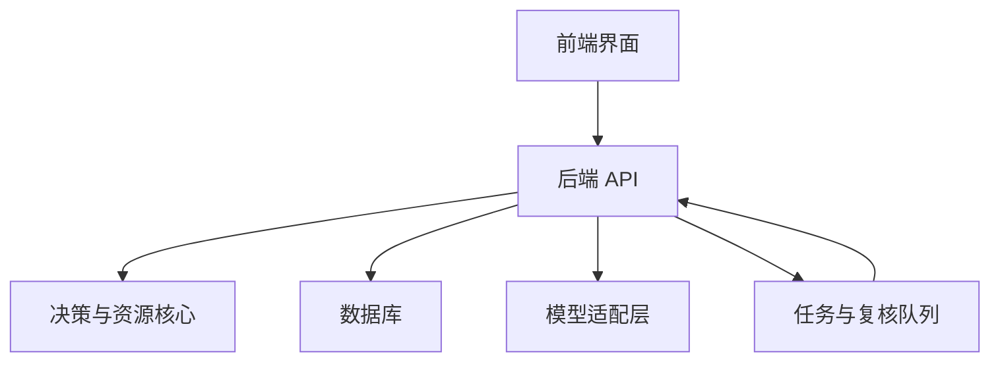
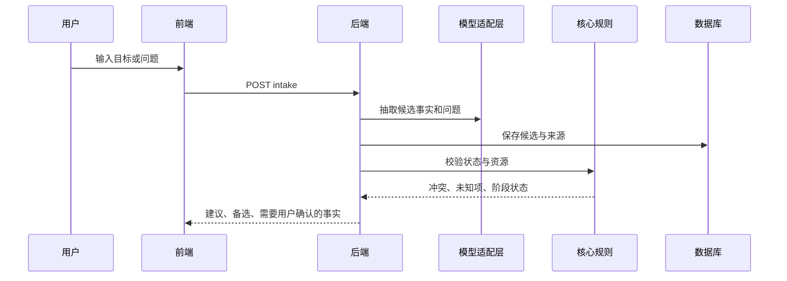
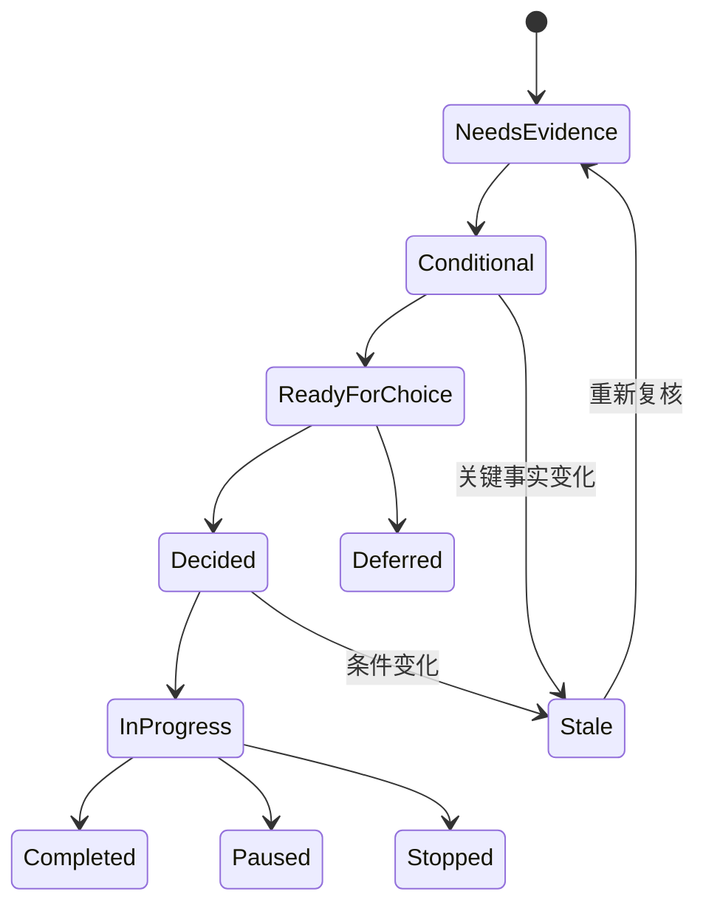

# ARCHITECTURE.md — 系统架构设计

## 1. 架构目标

人生管理系统 4.0 的软件架构要把三类能力分开：方法规则、业务状态和 AI 生成。方法规则用于确定哪些状态合法，业务状态用于保存用户真实记录，AI 用于理解输入、生成备选和解释取舍。这样本地 Codex 可以先实现可靠的核心闭环，再逐步接入模型、日历、任务、文件和商业化功能。

## 2. 推荐工程基线

当前历史包里曾出现 SQLite、PostgreSQL、不同端口和不同目录设想。为便于后续开发，本包统一采用以下工程基线，见 [docs/ADR-001-engineering-baseline.md](docs/ADR-001-engineering-baseline.md)。

| 层 | 推荐选择 | 原因 |
|---|---|---|
| 后端 | Python 3.12 + FastAPI | 与现有 Python 决策脚本衔接，适合快速建立 API |
| 数据库 | PostgreSQL | 需要事务、JSONB、审计、版本记录和未来多用户扩展 |
| 前端 | TypeScript + React | 适合构建对话、计划板、复盘和可解释状态界面 |
| 任务队列 | MVP 先使用数据库队列表，后续可加 Redis | 避免早期基础设施过重 |
| 文件存储 | 本地开发使用本地目录，生产再接对象存储 | 当前主要是文档、PPT、图和用户上传材料 |
| 模型层 | Provider adapter + mock provider | 开发和测试不依赖真实模型密钥 |

建议端口：前端 `3000`，后端 `8000`。历史包中的其他端口只作为参考资料保留。

## 3. 顶层结构



前端只负责展示、输入和确认。后端负责权限、状态、版本、资源核算和调用模型。模型层不能直接写数据库，也不能直接执行外部动作。

## 4. 建议目录

```text
apps/
  api/                 # FastAPI 服务
  web/                 # React 前端
packages/
  core/                # 纯业务规则：状态机、资源核算、版本失效
  schemas/             # OpenAPI / JSON Schema / 类型生成
  model-adapters/      # mock、OpenAI 或其他模型适配
  connectors/          # 日历、任务、文件等外部连接器，默认禁用
docs/                  # 工程说明和产品上下文
tests/                 # 集成测试与端到端测试
```

本包尚未创建上述应用代码目录。当前可运行源码在 `methodology/scientific-life-decisions/scripts/`，应作为规则原型和回归基线使用。

## 5. 现有方法源码接入方式

现有 Skill 源码快照放在 `methodology/scientific-life-decisions/`。本地 Codex 接手时不要直接修改这份快照。正确做法是把其中脚本的规则转写或封装到 `packages/core/`，保留原脚本测试作为回归参考。

特别注意：`check_life_resources.py` 内部使用 `Decimal`，API 层不要把 JSON 数字直接以浮点传入。建议在 API schema 中用字符串表示精确数值，进入核心层后转成 Decimal，返回时再转成字符串或 `null`。

## 6. 数据流

### 6.1 输入到建议



模型输出只能是候选事实、候选方案或解释草稿。核心规则负责判断状态是否合法，数据库负责保存版本和来源。

### 6.2 选择到执行

1. 用户在前端确认选择。
2. 后端保存 choice 记录和版本号。
3. 后端检查授权是否覆盖该行动。
4. 未授权时只生成待确认行动。
5. 已授权时写入 outbox。
6. 执行器从 outbox 读取，执行前再次检查授权和幂等键。
7. 结果写回 feedback_event 和 audit_event。

## 7. 前后端划分

| 能力 | 前端 | 后端 |
|---|---|---|
| 对话输入 | 收集文本、语音转写结果或文件引用 | 保存原始输入与来源 |
| 计划展示 | 展示目标、行动、状态、冲突 | 计算状态、排序复核队列 |
| 决策解释 | 展示建议、证据、未知项、反例 | 运行引擎，调用模型和核心规则 |
| 用户确认 | 展示确认控件 | 记录 choice、authorization、audit |
| 外部动作 | 不直接执行 | 通过授权和 outbox 执行 |
| 隐私设置 | 展示开关和撤销入口 | 服务端强制执行 |

## 8. 状态机

建议、选择和执行必须分开保存。



这里的状态图是产品行为图。数据库仍要按 SPEC 中的三个独立状态字段保存，不要把所有状态压进一个枚举。

## 9. 版本与失效

每一次建议都绑定输入快照和资源核算版本。以下变化会产生新版本，并把相关旧建议标为需要复核：目标变化、容量变化、已有承诺变化、硬约束变化、方案行动变化、事实纠正、授权撤销、用户选择改变。

MVP 可以用显式依赖表实现：`recommendation_dependency(recommendation_id, entity_type, entity_id, version)`。任何被依赖实体版本变更时，将建议加入 review_queue。

## 10. 主动服务架构

主动服务由四个部分组成：

| 组件 | 作用 |
|---|---|
| source_pollers | 按授权读取数据源，MVP 可先手工录入 |
| signal_detector | 发现冲突、机会或需要复核的条件变化 |
| proposal_generator | 生成候选建议和需要确认的问题 |
| notification_policy | 控制频率、静默时间、渠道和用户拒绝后的冷却 |

第一版不要自动发送消息给第三方，不要自动报名、付款、下单或投递。任何外部动作都通过 authorization 和 outbox 两道检查。

## 11. 安全与隐私

- 默认关闭所有外部连接器。
- 任何秘密只放在 `.env`，不得写进文档、前端代码或测试快照。
- 用户数据读取、建议生成、选择、执行、撤销都写 audit_event。
- 前端隐藏按钮不等于后端权限，后端必须强制校验。
- 多用户版本必须增加 tenant/user 隔离测试。
- 导出和删除能力要在商业化前设计清楚。

## 12. 可测试架构

核心规则必须能在没有模型、没有网络、没有数据库的情况下运行单元测试。API 集成测试使用 mock provider，验证接口、状态、审计和幂等。模型相关测试只验证结构和边界，不断言模型文本完全一致。

## 13. 当前已验证内容

现有 Skill 脚本已通过：

- 决策引擎单元测试 19 项。
- 资源核算单元测试 13 项。
- 系统控制算例自检 13 组。

详细记录见 [validation/VALIDATION_REPORT.md](validation/VALIDATION_REPORT.md)。这些测试证明方法原型能运行，不证明完整商业产品已经可用。
