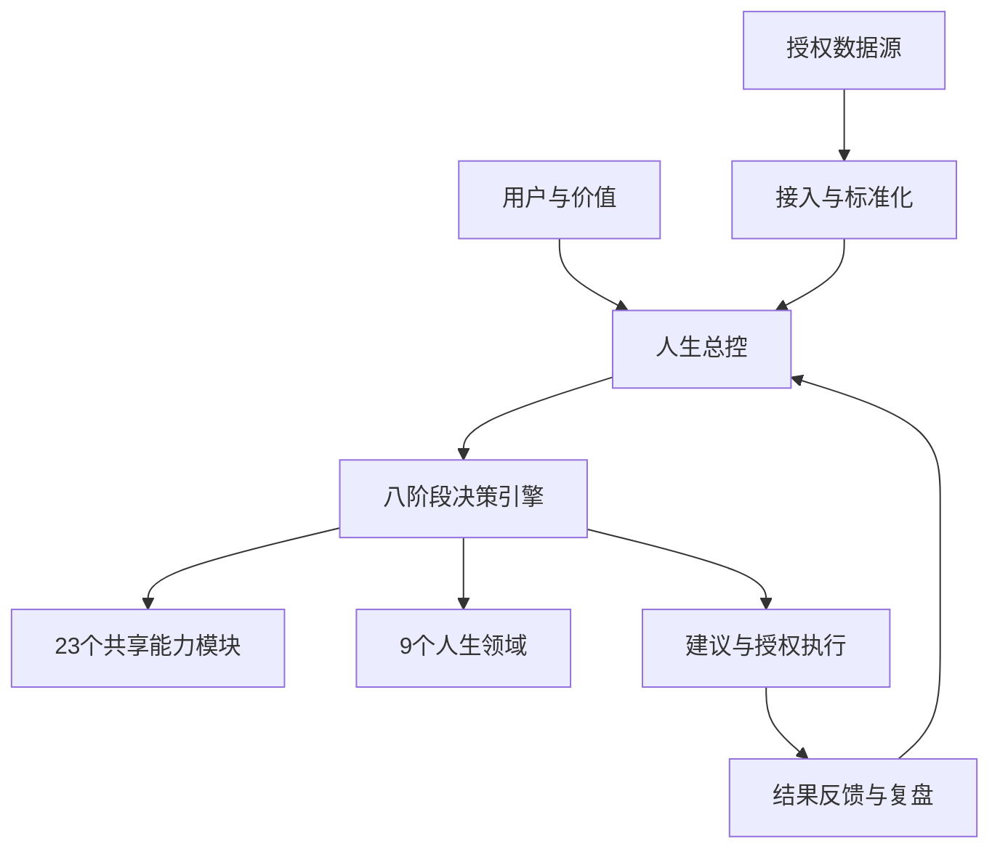

# 系统架构设计

## 总体分层



## 模块拆分

### 接入层

负责本地文件、日历、待办、笔记、财务和健康来源的适配。只读取授权范围；每次同步产生 SyncRun；原始数据与标准化观察分开保存。适配器必须支持重试、限速、撤销授权和增量同步。

### 状态与领域层

把观察转换为9个领域的状态快照，但不把单一指标直接等同于真实状态。每个状态应记录观测指标、时间、来源、置信度、未知项和用户修正。总控维护共同资源池，防止跨领域重复记账。

### 决策层

八阶段引擎按需调用23个模块：逻辑、认识论、决策理论、科学方法、概率统计、数学、运筹、经济、博弈、心理、伦理、历史、社会学、制度与组织、政治经济、法律、财务、健康、系统科学、控制论、项目管理、计算机与AI、英语与信息检索。模块不是固定流水线，只有与问题相关的模块才被调用。

### 主动服务层

调度器定期或事件触发检查：数据变化、目标偏差、资源冲突、截止日期、反馈窗口和同步失败。问询规划器先查已有资料，再按信息价值排序问题；建议服务输出依据、假设、代价、风险、条件、推荐和用户选择入口；反馈服务在窗口结束后比较预期与实际。

### 持久化与治理层

第一版可使用 SQLite 加 JSON/Markdown 投影；生产版可拆为关系数据库、对象存储和向量/全文检索。所有外部数据必须有来源、授权、更新时间和删除策略；所有自动动作写入审计日志。

## 数据流

```text
授权来源
  → 增量同步
  → 原始记录留存
  → 标准化观察
  → 去重与关联
  → 领域状态快照
  → 总控资源检查
  → 决策引擎/主动问询
  → 建议或待确认问题
  → 用户选择与授权
  → 行动和结果
  → 反馈更新、版本审计
```

## 前后端划分

前端负责总控首页、领域状态、待回答问题、决策工作台、建议卡片、行动看板、复盘和授权管理。后端负责身份、数据接入、规范化、状态计算、八阶段编排、能力模块路由、问询队列、通知、审计和任务调度。AI服务只作为可替换的推理组件，不能直接绕过权限层写入决定或执行外部动作。

## 推荐实现顺序

先做本地 CLI/API + SQLite + Markdown投影；再做只读数据接入和主动问询；然后做网页界面和通知；最后再考虑云端同步、多用户、移动端和商业化部署。任何阶段都保留纯文件模式，使用户可以导出、审阅和恢复数据。

