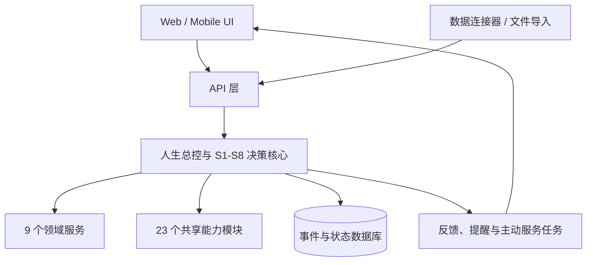
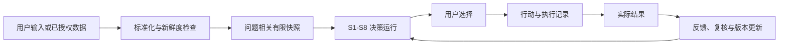

# ARCHITECTURE.md

## 总体架构



## 分层

### 表现层

展示当前问题、有限快照、证据、方案比较、复核意见、用户选择、行动计划和反馈。前端不能自行计算最终决策规则。

### 应用层

编排 intake、decision run、review、choose、execute、feedback 等用例；检查授权；生成 traceId；调用领域与能力模块。

### 核心领域层

包含人生总控、S1—S8 状态机、约束求解、资源账本、证据账本、版本失效、状态一致性和反馈回退。核心逻辑应尽量纯函数化，便于测试。

### 领域适配层

9 个领域维护各自目标、状态、项目和风险；23 个能力模块提供方法，不拥有用户人生数据，也不能绕过总控直接下结论。

### 基础设施层

数据库、队列/定时任务、模型提供商、日历/任务连接器、文件导入、通知、日志、审计、身份与权限。

## 数据流



## 关键边界

- 外部连接器只负责获取/导入，不负责解释人生意义或替用户选择。
- 模型只通过结构化能力接口参与，并必须返回证据引用、假设、未知和反转条件。
- 数据库保存事件和版本，避免直接覆盖历史判断。
- 所有资源消耗必须带单位、周期、来源和置信度。
- 主动服务只能在授权范围内运行；敏感数据最小化；关键冲突暂停并请求确认。

## 推荐工程目录

```text
apps/web/                 # 前端
apps/api/                 # HTTP API
packages/domain/          # 总控、决策状态机、资源与证据规则
packages/schemas/         # 共享类型与 API schema
packages/capabilities/    # 23 个能力模块适配器
packages/connectors/      # 文件、日历、任务等连接器
packages/workers/         # 主动服务、提醒、反馈任务
packages/ui/              # 共享组件
db/migrations/            # 数据库迁移
tests/                    # 单元、集成、场景回归测试
docs/                     # ADR、产品与接口文档
```

