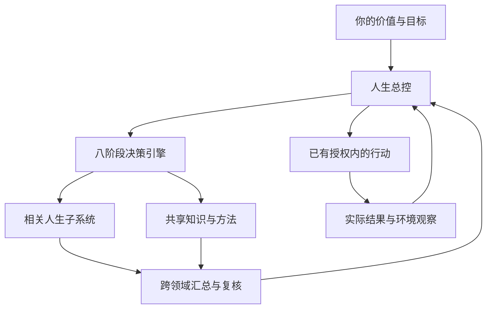

# 投资顾问：本地读取的历史消息

来源：https://chatgpt.com/g/g-p-6a9cf51df83881918669d8d8813d9090/c/6a9cf4dd-3b44-83e8-a37f-ea119dceb1ac

本文件由应用 read_thread 接口分页读取并按时间排列，共 42 个返回轮次。它保留接口提供的用户和助手文字，不代表平台完整数据导出。每项读取上限为 20000 字符；工具调用、隐藏内容、分支历史和原始附件可能不在接口结果中。出现 chatgpt-content-reference 表示附件引用，文件本身尚未下载。归档期间新增消息可能未包含。

## 轮次 bbb21e19-2038-411c-8cf3-ee61b5c93c93

时间：1970-01-21T16:49:50.464Z

### 用户

你好

### 助手

你好！有什么需要我帮你的吗？

## 轮次 bbb21e8a-d964-4b81-b3ae-5be18da070a3

时间：1970-01-21T16:49:50.483Z

### 用户

你是谁

### 助手

我是 ChatGPT，你的 AI 助手。可以用中文帮你查资料、写文章、做 PPT 和表格，也能协助编程、分析数据、解决电脑问题。

## 轮次 bbb21cc8-d7ef-4284-9330-389fedea6cc9

时间：1970-01-21T16:49:50.514Z

### 用户

你是什么模型

### 助手

我是 OpenAI 的 ChatGPT。**当前对话没有向我提供具体的模型型号**，所以我无法准确确认是哪个版本，不能随便报一个型号。

## 轮次 bbb2197d-15da-4ecf-afde-f6a3ea8965a8

时间：1970-01-21T16:49:50.540Z

### 用户

你能帮我做什么

### 助手

我可以帮你**查资料、写文章、做 Word 和 PPT、整理表格、分析数据、生成或修改图片**，也能写代码、排查电脑和服务器问题。

比如，你给我一份材料，我可以整理成能直接使用的汇报文档；给我一张表，我可以清洗数据、做统计、分析规律；给我一个报错截图，我可以带你逐步解决。你想学一项技能、研究一个项目，也可以让我讲清楚原理，再拆成具体可执行的步骤。

**你不用先想好怎么做，直接告诉我想达到什么结果，或者把文件、截图发过来就行。**

## 轮次 bbb21eda-f5e4-4305-a1ff-d19a41f33da6

时间：1970-01-21T16:49:50.576Z

### 用户

如果从你个人一生的发展出发，把这套能力完整地搭起来，我建议你不要把目标理解成“多学几门课”，而是要逐步建立一套认识世界、判断真假、理解他人、管理自己、配置资源和推动事情的完整系统。最先应该学的是逻辑学、认识论和科学方法，具体包括命题与论证、必要条件和充分条件、归纳与演绎、因果与相关、反例、常见逻辑谬误、证据等级、可证伪性、观察偏差和如何形成可靠结论，因为这些内容决定你以后学到的所有知识会不会被正确使用；同时补齐基础数学，不必追求竞赛难度，但要真正掌握代数、函数、指数与对数、集合、向量、矩阵、微积分的基本思想，再系统学习概率论和统计学，包括条件概率、贝叶斯公式、随机变量、期望、方差、常见分布、大数定律、中心极限定理、抽样、置信区间、假设检验、回归、实验设计和因果推断，因为这些知识能训练你在信息不完整时表达“有多大可能”，而不是只会说“是或者不是”；在这个基础上继续学习决策理论、运筹学和博弈论，决策理论重点理解期望效用、风险厌恶、信息价值、决策树、多准则决策和敏感性分析，运筹学重点理解线性规划、整数规划、资源配置、排队、调度、网络流和多目标优化，博弈论重点学习策略、收益、最佳反应、纳什均衡、重复博弈、信息不对称、信号与承诺，这三门知识分别帮助你解决“我应该怎么选”“有限资源怎么分配”和“别人会根据我的行动怎样反应”；然后学习经济学，先学微观经济学中的供需、边际成本、机会成本、激励、外部性、交易成本、委托代理、逆向选择和道德风险，再学宏观经济学中的通货膨胀、就业、利率、货币、财政和经济周期，同时学习马克思主义政治经济学，从生产关系、利益结构、资本、劳动、分配和历史条件理解社会，不把任何一种理论当成万能答案，而是比较不同理论在什么条件下解释力更强；心理学方面要重点学习认知心理学、社会心理学、行为经济学和人格心理学，理解注意、记忆、情绪、动机、习惯、确认偏误、锚定效应、损失厌恶、从众、群体极化、权威服从、关系依恋和冲突机制，这会帮助你认识自己的局限，也能让你更准确地理解别人，而不是把人的行为简单归结为聪明、愚蠢、善良或者恶意；社会科学方面还要补充社会学、组织行为学、政治学和制度分析，具体理解家庭、阶层、组织、官僚体系、权力、合法性、正式规则、非正式规则、群体身份、组织惯性和制度激励，因为很多现实结果不是由某一个人的意愿造成的，而是由结构、流程和利益共同产生的；历史方面要系统学习中国史、世界史、中国近现代史、经济史、科技史和思想史，不是为了背年份，而是训练你理解事情的来龙去脉、长期积累、路径依赖、周期变化和偶然事件怎样共同塑造今天，同时把毛泽东思想中的调查研究、实事求是、实践论、矛盾分析、主要矛盾、战略与战术、群众路线和阶段性目标作为一种分析和行动方法来研究，但要始终结合具体条件、事实材料和现代科学方法，而不是只背结论；系统科学方面可以从一般系统论、控制论、系统动力学、复杂系统和钱学森的系统工程思想入手，重点理解系统边界、要素、关系、输入、输出、状态、反馈、延迟、扰动、稳定性、可控性、可观测性和开放复杂巨系统，这会让你逐渐摆脱“看到一个原因就解释全部结果”的简单思维，学会分析多个因素相互作用、反馈放大和长期演化；计算机与数据能力也应当成为现代人的基础素养，至少要学会Excel、SQL、Python、数据清洗、数据可视化、基础算法、数据库、网络和信息安全，理解机器学习、大模型和自动化工具的基本原理，知道如何用人工智能帮助搜索、阅读、写作、分析和编程，也知道它可能产生幻觉、偏差、隐私泄露和错误推断，不需要一开始成为专业程序员，但要能够把重复性工作转化为流程和工具；语言与表达能力同样重要，你需要专门训练阅读、写作、提问、倾听、演讲、谈判、说服、冲突处理和结构化表达，具体做到能把同一个复杂问题分别用一句话、一页纸和一篇完整报告讲明白，能区分事实、判断、意见和建议，能理解对方真正关心的利益和顾虑，表达不是知识的包装，而是知识进入现实的通道；管理能力方面要学习目标设定、任务分解、优先级、项目管理、授权、反馈、会议、流程、组织协作、风险管理和复盘，因为一个人无论创业、工作还是管理家庭，最终都要面对有限时间、有限资源、多人合作和计划变化的问题；个人财务方面要学习收入、消费、预算、现金流、资产负债、复利、通货膨胀、保险、债券、股票、指数基金、资产配置、风险收益和常见骗局，目标不是追求快速发财，而是建立不因一次意外、一次投资失误或者收入中断就陷入被动的财务结构；法律方面至少要理解宪法、民法、合同、侵权、劳动、公司、刑法和行政法的基本边界，知道权利、义务、证据、责任和程序的重要性，因为很多人生选择不是单纯的道德判断，而是具有明确的法律后果；健康方面要系统了解运动、力量训练、有氧能力、营养、睡眠、压力、成瘾、慢性病风险和医学证据，身体不是学习和事业之外的附属品，而是所有认知能力、情绪稳定和长期行动力的物质基础；英语应该作为工具长期学习，重点不是追求口音，而是能够阅读教材、论文、技术文档和高质量原始资料，听懂公开课，使用英文关键词检索信息，因为很多领域的一手知识首先以英文出现；最后还要保留文学、艺术、音乐、美学和伦理学，它们能够训练你理解人的情感、尊严、悲剧、欲望和价值冲突，避免自己变成只会计算效率、却不知道什么值得追求的人。学习顺序上，前一年应把主要精力放在逻辑学、概率统计、英语、写作、计算机基础和经济学上，同时少量阅读历史、心理学、马克思主义和毛泽东思想；第二年进一步学习线性代数、因果推断、运筹学、博弈论、社会学、法律、管理学和个人财务；第三年再深入系统科学、控制论、复杂系统、机器学习、组织行为和综合决策，并开始围绕真实问题做跨学科项目。每周可以固定投入十小时左右，其中三小时学数学和统计，两小时学逻辑、经济或社会科学，两小时练编程和数据，两小时阅读历史、哲学或经典著作，一小时写学习笔记和决策复盘；每学一个知识点，都不要只记定义，而要能够用自己的话解释、做一个小例子、指出它的适用条件、找到一个反例并应用到真实问题。最终你要形成的不是一个庞杂的知识仓库，而是这样一种稳定能力：遇到问题时能先定义清楚，找到可靠信息，识别自己的偏见，用概率和数据判断不确定性，理解人的动机与制度约束，设计多个方案，考虑资源和对手反应，采取小规模行动，通过反馈不断修正自己，同时知道哪些事情虽然有效率，却不一定正确或值得做

### 助手

这段内容可以作为一份**长期能力地图，但还不能直接当作学习计划**。它的核心是：找到可靠信息，形成判断，理解人与环境，在资源有限时做选择，推动行动，再根据结果修正。

它把“要学什么”列得很完整，但还有三个关键问题没有解决：**每门学到什么程度就够用，哪些值得你优先投入，以及用什么实际成果检验是否学会。**例如，“学统计学”范围很大，“能判断一份调查数据是否支持它的结论”才是可以练习和检验的能力。把清单中的学科逐一转换成这样的能力目标，计划才容易落地。

你希望我基于这份内容，具体帮你解决什么问题？

## 轮次 bbb21932-f7d4-4a1a-aff2-e815e06e77a4

时间：1970-01-21T16:49:50.648Z

### 用户

你怎么看待这个能力体系

### 助手

我的看法是：**这是一份值得保留的终身学习地图，但它对“学得全面”强调得比较充分，对“怎样形成真正的能力”还需要进一步设计。**它的方向有价值，三年的具体安排则不宜直接照搬。

我最认可的是，它把认识问题、判断证据、理解他人、配置资源、采取行动和反思修正联系了起来。现实中的困难，往往确实同时涉及这些方面。例如，一个项目做不起来，可能既有需求判断错误，也有利益分配、沟通和执行的问题。能够从多个角度检查原因，会比只熟悉一种解释方法更有帮助。同时，它把健康、文学、艺术和伦理放进来，也保留了一个重要问题：你希望过什么样的生活，什么事情值得投入。

不过，**学习这些学科，并不会自动产生能够应对所有事情的判断力。**逻辑可以帮助你检查推理，但前提是否真实，需要具体调查；统计可以帮助你分析数据，但数据漏掉了什么，需要领域经验。一个人即使熟悉博弈论，也未必了解某个行业真实的合作规则。学习研究同样强调，专业能力依赖长期积累、有组织的领域知识，某一方面的熟练并不必然迁移到其他方面。[《人是如何学习的Ⅱ》](https://www.nationalacademies.org/read/24783/chapter/7)

因此，我会给这套体系增加一个更明确的要求：**保持广泛理解，同时在一两个具体领域持续做深。**这些领域可以随着人生阶段变化，但必须让你反复面对真实问题、作出判断并看到结果。否则，很容易对很多事情都能讲出一套道理，却无法确认自己的解释到底对不对。跨学科能力也需要这样的落点，才能检验不同知识是否真的配合起来发挥了作用。

原文已经提出“用自己的话解释、举例、找反例、实际应用”，这部分很好。我会进一步加上**外部反馈和成果标准**。例如，学完数据分析后，能否独立处理一份陌生数据，说明它支持哪些结论、不支持哪些结论，并让别人检查你的分析？学完表达后，对方能否准确理解你的意思，并据此完成一项任务？这些表现，比“看完一本书”更能说明能力有没有形成。明确目标的练习、技能之间的组合训练，以及有针对性的反馈，也是学习研究强调的要点。[卡内基梅隆大学学习原则](https://www.cmu.edu/teaching/principles/learning.html)

学习顺序也需要更灵活。数学确实存在一些先修关系，但表达、调查、协作和实际项目可以从一开始就练。按每周十小时计算，三年大约是 **1560 小时**；分散到这么多领域，我认为很难同时达到文中描述的深度。我更倾向于让基础学习与实际任务同步进行，在任务暴露出具体短板时，再集中补课。例如，做一次小型调查，就可以同时练提问、抽样意识、证据判断、数据整理和报告写作，不必等到第三年才尝试综合运用。

还有一点需要保持清醒：**不同知识，需要不同的检验方式。**逻辑论证要检查推理是否成立，经验判断要看证据，历史解释要核对史料和具体条件，伦理问题还要讨论价值与责任。包括马克思主义、毛泽东思想和系统科学在内，都应保留原文强调的适用条件意识，避免用几个宏大概念替代具体分析。

如果由我使用这套体系，我会定期检查三个实际变化：面对不熟悉的问题，能否更快找到可信信息；作出判断时，能否说清依据、局限以及什么证据会让自己改变看法；采取行动后，能否根据反馈改进下一次做法。这些变化，才值得作为长期学习的进度标尺。

如果有帮助，可以设置“每周复盘学习成果”的提醒，留一点时间检查所学是否真正用上。


::chatgpt-content-reference{index="0"}

## 轮次 bbb210d1-4408-4313-9868-5bf1f86b5b46

时间：1970-01-21T16:49:50.761Z

### 用户

Create a scheduled task: 每周复盘学习成果

## 轮次 bbb21d1a-685e-4392-af8f-ad7c20b8e288

时间：1970-01-21T16:49:50.780Z

### 用户

这些能力你掌握哪些

### 助手

你列出的这些能力，**大部分我都能讲解，并协助你实际运用；其中，我最擅长的是分析推理、数据处理、编程和文字表达。**但不能把这理解成我在每个领域都具有专家水平。

| 能力领域 | 我能具体帮你做什么 |
|---|---|
| 逻辑、认识论、科学方法 | 拆解论证，检查推理漏洞，区分事实与假设，寻找反例，设计验证方法 |
| 数学、概率统计、数据分析 | 解释公式，建立模型，清洗数据，做统计分析和可视化，检查结论是否得到数据支持 |
| 决策理论、运筹学、博弈论 | 比较方案，分析风险与机会成本，建立资源分配模型，推演不同参与者的选择 |
| 经济学、心理学、社会学、历史与思想理论 | 解释概念，比较不同理论，结合材料分析利益、动机、制度和历史条件 |
| 系统科学、计算机与 AI | 梳理系统关系和反馈，设计流程，写代码、SQL 和自动化工具，协助排查问题 |
| 写作、表达与项目管理 | 写报告、做 PPT，组织论证，模拟谈判，分解任务，制定执行与复盘方案 |

**我比较明显的优势，是能把这些知识组合起来处理同一个问题。**例如，你拿来一个项目，我可以帮助你调查背景、整理数据、比较方案、估算资源，再把分析写成报告或做成工具。涉及具体事实和计算时，仍然需要查证、运行和检验。

我的局限主要在现实实践上：我没有亲身生活和行业从业经历，不能仅凭几段描述就准确理解一个人或一个组织。谈判、领导、建立信任、管理情绪、坚持行动，这些我可以提供方法、模拟练习和反馈，实际能力需要你在真实情境中形成。法律、医疗、投资等具体专业问题，也需要结合最新资料和专业判断。

另外，**“每周复盘学习成果”已创建，安排在每周日北京时间晚上 8 点左右提醒你。**

## 轮次 bbb2112a-8e14-4d5e-a383-c20f352e2018

时间：1970-01-21T16:49:50.855Z

### 用户

那你可以参考这些方式给我做出更科学的人生决策吗

### 助手

可以。**我可以把这些方法结合起来，帮助你作出依据更充分、风险更可控的人生选择，并给出明确的建议。**科学的方法能改善判断，但无法消除不确定性；什么值得追求，仍然需要以你的价值取向为准。

具体讨论一件事时，我会先弄清楚：你真正希望得到什么，当前有哪些选择，以及时间、收入、家庭责任、身体状态等现实限制。然后把已经知道的事实、暂时的推测和需要补充的信息分开，避免在错误前提上分析。

接着，我会比较各个方案的收益、代价、成功所需的条件，以及最坏结果是否承受得起。能可靠估算的部分就用数据和概率；资料不足的部分会保留不确定性。涉及其他人时，还会考虑他们的利益和可能反应。对影响大、难以撤回的选择，尤其重视能否先做一次小规模尝试，获取真实反馈。

最后，我会给你一个具体结果：**目前更建议选什么、为什么、什么新信息会改变建议，以及下一步可以做什么。**之后再对照实际结果复盘，逐渐了解哪些判断方法更适合你。

你现在最拿不准的一件人生选择是什么？先用自己的话告诉我就行，我会帮你把问题理清。

## 轮次 bbb21b6b-1279-42e2-add8-da51d847d6b8

时间：1970-01-21T16:49:50.926Z

### 用户

我怎么用自己的codex建立人生管理系统

### 助手

可以。建议你把它建成**一个由 Codex 持续维护的个人项目**：把你的情况、目标、行动和决策依据保存下来，每次讨论都能接着往下做。

我已经做好了一套可直接使用的起步文件：

:chatgpt-content-reference{index="0"}

这套系统主要管理五件事：

| 部分 | 记录什么 | Codex 帮你做什么 |
|---|---|---|
| 个人情况 | 你重视什么、有哪些资源和限制 | 让建议符合你的实际处境 |
| 目标与行动 | 近期想达到什么、下一步是什么 | 分解任务，检查阻碍和进展 |
| 学习与能力 | 学到了什么、用在哪里 | 设计练习，检查实际成果 |
| 重要决策 | 备选方案、证据、风险、当时的判断 | 比较选择，提出建议和验证办法 |
| 定期复盘 | 实际结果与原先预期的差异 | 修正判断，调整下一步 |

**你可以这样启用：**

1. 下载并解压，得到 `life-management` 文件夹，放在电脑上固定的位置。
2. 用你的 Codex 打开这个文件夹。使用 VS Code 就打开该文件夹并进入 Codex 扩展；使用命令行，就在该文件夹的终端运行 `codex`。
3. 在新对话里输入：

```text
请读取 AGENTS.md、README.md 和 START_HERE.md，
按照 START_HERE.md 带我初始化这套人生管理系统。
```

它会先了解你未来四周最希望改善的一件事、能够投入的时间和当前卡点，再整理出个人情况、目标草案和下一步行动。**你不用先把整个人生都规划好。**

日常使用也可以很简单。你直接说：“记录一下，今天做了什么、遇到什么问题。”Codex 负责整理到对应文件。准备作出重要选择时，说：“帮我做一个决定。”它会记录依据、比较方案，并说明什么新信息会改变建议。每周说：“做一次周复盘。”它就根据实际记录检查进展。

这里的关键是 **`AGENTS.md` 工作规则与长期记录文件**。官方文档说明，Codex 会读取项目中的 `AGENTS.md`；我已经在其中写好了每次需要读取哪些资料、怎样区分事实与推测、怎样保存历史判断。新对话因此能从文件恢复上下文。[OpenAI 官方说明](https://learn.chatgpt.com/docs/agent-configuration/agents-md)

数据先通过你的主动输入和提供的材料进入系统。以后有具体需要，再接入日历或其他数据源。个人资料只放必要内容，并做好备份；本地保存也不等于模型处理完全离线。

你已经设置的周日学习复盘提醒可以继续使用，但它**不能直接读取电脑上的这些文件**。如果以后配置自动生成本地周报，需要使用支持本地项目的桌面定时任务，并保持电脑开机、应用运行；CLI 和 IDE 扩展本身没有定时任务管理界面。[OpenAI 定时任务说明](https://learn.chatgpt.com/docs/automations)

先用它连续处理两周的真实问题，再根据使用情况删减字段、增加功能。最初的验收标准很具体：**你能否更容易找到以前的判断依据，并把一个重要目标推进一步。**

## 轮次 bbb215fa-8845-4f66-9d7c-676469148a6d

时间：1970-01-21T16:49:51.296Z

### 用户

我需要对codex进行哪些改造或设置？

### 助手

**主要需要配置工作规则、长期记录和文件权限，通常不用修改 Codex 源码，也不用重新训练模型。**你要让它每次都了解你的背景，按固定方法分析，并把结果保存下来。

针对你的人生管理系统，我建议这样设置：

| 项目 | 具体怎么设置 | 当前是否需要 |
|---|---|---|
| 固定项目目录 | 每次都打开同一个 `life-management` 文件夹 | 必需 |
| 工作规则 | 用 `AGENTS.md` 规定读取哪些资料、怎样分析和保存 | 必需，起步包已包含 |
| 长期记录 | 保存个人情况、目标、行动和决策历史，并在新对话开始时读取 | 必需，起步包已包含 |
| 文件权限 | 允许 Codex 在项目内读取、修改文件 | 必需，需要在你的客户端设置 |
| 信息输入 | 先通过日常对话和你提供的文件输入真实情况 | 必需 |
| Skills 技能 | 将“重大决策”“安排下一步”“周复盘”封装成可重复调用的技能 | 可后加 |
| 数据连接与自动化 | 按需要连接日历、任务工具，设置自动复盘 | 可后加 |

**最重要的改造是工作规则。**我给你的 `AGENTS.md` 已经要求它：先读取当前情况和目标，区分事实、推测与未知，保留决策依据，更新行动和当前摘要。Codex 官方支持读取项目中的 `AGENTS.md`，但其他记录文件需要通过规则明确要求读取。[官方说明](https://learn.chatgpt.com/docs/agent-configuration/agents-md)

**权限方面，允许项目内正常读写即可。**如果使用命令行，在人生管理项目目录中启动：

```bash
codex --sandbox workspace-write --ask-for-approval on-request
```

这样，项目内的常规整理和文件更新可以自动进行；超出允许范围的操作再按权限规则处理。桌面版或 VS Code 扩展中，可以在权限选项里选择允许工作区读写的对应模式。[权限说明](https://learn.chatgpt.com/docs/agent-approvals-security)

如果以后需要长期保存配置，CLI 和 IDE 扩展使用的用户配置通常在 `~/.codex/config.toml`，项目也可以有自己的配置。**修改时应保留你已有的设置**；当前文档同时存在沙箱设置和新版权限配置，两套不能直接混用。[配置说明](https://learn.chatgpt.com/docs/config-file/config-basic)、[权限配置说明](https://learn.chatgpt.com/docs/permissions)

技能可以稍后再加。起步包里的 `WORKFLOWS.md` 是已经写好的操作流程，**目前并没有安装成原生 Skills**。先实际使用，确定哪些流程经常重复，再将它们做成技能；技能本质上是可复用的指令、参考资料和可选脚本。[Skills 官方说明](https://learn.chatgpt.com/docs/build-skills)

设置完成后，先做一次很具体的检查：告诉 Codex 一条真实情况，让它保存；然后新开对话，要求它读取项目文件并复述这条情况。再让它建立一个行动、更新一次进展。**能够正确保存、重新读取并继续推进，基础系统就搭起来了。**

你可以直接使用之前的文件包：:chatgpt-content-reference{index="0"}。其中已经准备好了规则和记录结构，接下来主要是在你自己的 Codex 中打开项目、设置读写权限并完成初始化。

## 轮次 bbb21ba1-c02a-47f6-9837-a5ffadb9e4a6

时间：1970-01-21T16:49:51.542Z

### 用户

我看到你并没有将这些能力写入你的md文件中，那我如何确保你每次做出的决策都是基于以上能力做出的科学准确的

## 轮次 bbb21cba-f9ec-4df6-b16a-76b26c737649

时间：1970-01-21T16:49:51.841Z

### 用户

如果从你个人一生的发展出发，把这套能力完整地搭起来，我建议你不要把目标理解成“多学几门课”，而是要逐步建立一套认识世界、判断真假、理解他人、管理自己、配置资源和推动事情的完整系统。最先应该学的是逻辑学、认识论和科学方法，具体包括命题与论证、必要条件和充分条件、归纳与演绎、因果与相关、反例、常见逻辑谬误、证据等级、可证伪性、观察偏差和如何形成可靠结论，因为这些内容决定你以后学到的所有知识会不会被正确使用；同时补齐基础数学，不必追求竞赛难度，但要真正掌握代数、函数、指数与对数、集合、向量、矩阵、微积分的基本思想，再系统学习概率论和统计学，包括条件概率、贝叶斯公式、随机变量、期望、方差、常见分布、大数定律、中心极限定理、抽样、置信区间、假设检验、回归、实验设计和因果推断，因为这些知识能训练你在信息不完整时表达“有多大可能”，而不是只会说“是或者不是”；在这个基础上继续学习决策理论、运筹学和博弈论，决策理论重点理解期望效用、风险厌恶、信息价值、决策树、多准则决策和敏感性分析，运筹学重点理解线性规划、整数规划、资源配置、排队、调度、网络流和多目标优化，博弈论重点学习策略、收益、最佳反应、纳什均衡、重复博弈、信息不对称、信号与承诺，这三门知识分别帮助你解决“我应该怎么选”“有限资源怎么分配”和“别人会根据我的行动怎样反应”；然后学习经济学，先学微观经济学中的供需、边际成本、机会成本、激励、外部性、交易成本、委托代理、逆向选择和道德风险，再学宏观经济学中的通货膨胀、就业、利率、货币、财政和经济周期，同时学习马克思主义政治经济学，从生产关系、利益结构、资本、劳动、分配和历史条件理解社会，不把任何一种理论当成万能答案，而是比较不同理论在什么条件下解释力更强；心理学方面要重点学习认知心理学、社会心理学、行为经济学和人格心理学，理解注意、记忆、情绪、动机、习惯、确认偏误、锚定效应、损失厌恶、从众、群体极化、权威服从、关系依恋和冲突机制，这会帮助你认识自己的局限，也能让你更准确地理解别人，而不是把人的行为简单归结为聪明、愚蠢、善良或者恶意；社会科学方面还要补充社会学、组织行为学、政治学和制度分析，具体理解家庭、阶层、组织、官僚体系、权力、合法性、正式规则、非正式规则、群体身份、组织惯性和制度激励，因为很多现实结果不是由某一个人的意愿造成的，而是由结构、流程和利益共同产生的；历史方面要系统学习中国史、世界史、中国近现代史、经济史、科技史和思想史，不是为了背年份，而是训练你理解事情的来龙去脉、长期积累、路径依赖、周期变化和偶然事件怎样共同塑造今天，同时把毛泽东思想中的调查研究、实事求是、实践论、矛盾分析、主要矛盾、战略与战术、群众路线和阶段性目标作为一种分析和行动方法来研究，但要始终结合具体条件、事实材料和现代科学方法，而不是只背结论；系统科学方面可以从一般系统论、控制论、系统动力学、复杂系统和钱学森的系统工程思想入手，重点理解系统边界、要素、关系、输入、输出、状态、反馈、延迟、扰动、稳定性、可控性、可观测性和开放复杂巨系统，这会让你逐渐摆脱“看到一个原因就解释全部结果”的简单思维，学会分析多个因素相互作用、反馈放大和长期演化；计算机与数据能力也应当成为现代人的基础素养，至少要学会Excel、SQL、Python、数据清洗、数据可视化、基础算法、数据库、网络和信息安全，理解机器学习、大模型和自动化工具的基本原理，知道如何用人工智能帮助搜索、阅读、写作、分析和编程，也知道它可能产生幻觉、偏差、隐私泄露和错误推断，不需要一开始成为专业程序员，但要能够把重复性工作转化为流程和工具；语言与表达能力同样重要，你需要专门训练阅读、写作、提问、倾听、演讲、谈判、说服、冲突处理和结构化表达，具体做到能把同一个复杂问题分别用一句话、一页纸和一篇完整报告讲明白，能区分事实、判断、意见和建议，能理解对方真正关心的利益和顾虑，表达不是知识的包装，而是知识进入现实的通道；管理能力方面要学习目标设定、任务分解、优先级、项目管理、授权、反馈、会议、流程、组织协作、风险管理和复盘，因为一个人无论创业、工作还是管理家庭，最终都要面对有限时间、有限资源、多人合作和计划变化的问题；个人财务方面要学习收入、消费、预算、现金流、资产负债、复利、通货膨胀、保险、债券、股票、指数基金、资产配置、风险收益和常见骗局，目标不是追求快速发财，而是建立不因一次意外、一次投资失误或者收入中断就陷入被动的财务结构；法律方面至少要理解宪法、民法、合同、侵权、劳动、公司、刑法和行政法的基本边界，知道权利、义务、证据、责任和程序的重要性，因为很多人生选择不是单纯的道德判断，而是具有明确的法律后果；健康方面要系统了解运动、力量训练、有氧能力、营养、睡眠、压力、成瘾、慢性病风险和医学证据，身体不是学习和事业之外的附属品，而是所有认知能力、情绪稳定和长期行动力的物质基础；英语应该作为工具长期学习，重点不是追求口音，而是能够阅读教材、论文、技术文档和高质量原始资料，听懂公开课，使用英文关键词检索信息，因为很多领域的一手知识首先以英文出现；最后还要保留文学、艺术、音乐、美学和伦理学，它们能够训练你理解人的情感、尊严、悲剧、欲望和价值冲突，避免自己变成只会计算效率、却不知道什么值得追求的人。学习顺序上，前一年应把主要精力放在逻辑学、概率统计、英语、写作、计算机基础和经济学上，同时少量阅读历史、心理学、马克思主义和毛泽东思想；第二年进一步学习线性代数、因果推断、运筹学、博弈论、社会学、法律、管理学和个人财务；第三年再深入系统科学、控制论、复杂系统、机器学习、组织行为和综合决策，并开始围绕真实问题做跨学科项目。每周可以固定投入十小时左右，其中三小时学数学和统计，两小时学逻辑、经济或社会科学，两小时练编程和数据，两小时阅读历史、哲学或经典著作，一小时写学习笔记和决策复盘；每学一个知识点，都不要只记定义，而要能够用自己的话解释、做一个小例子、指出它的适用条件、找到一个反例并应用到真实问题。最终你要形成的不是一个庞杂的知识仓库，而是这样一种稳定能力：遇到问题时能先定义清楚，找到可靠信息，识别自己的偏见，用概率和数据判断不确定性，理解人的动机与制度约束，设计多个方案，考虑资源和对手反应，采取小规模行动，通过反馈不断修正自己，同时知道哪些事情虽然有效率，却不一定正确或值得做
我需要你去全面搜集整理这些。资料并学会这些能力体系。把它固化成你的能力。，以后每次决策都是按照严格按照这些规则进行决策。

### 助手

**第一版资料整理与规则固化已经完成，并写入更新后的项目文件。**你提出的能力体系已拆成 **23 个方法模块、66 项核心来源记录**，配套决策流程、复核要求和应用案例。

:chatgpt-content-reference{index="0"}

主要内容如下：

| 文件 | 已落实的内容 |
|---|---|
| `METHODS.md` | 23个模块各自的知识范围、适用条件、输入、步骤、输出与局限 |
| `RESOURCES.md`、`RESEARCH/` | 教材、课程、原始文本和官方资料；逐项注明实际阅读深度 |
| `AGENTS.md` | 要求决策前读取方法与协议，按问题调用相关能力 |
| `DECISION_PROTOCOL.md` | 从定义问题、核验证据到比较方案、行动和复盘的执行规则 |
| `REVIEW_CHECKLIST.md` | 检查假设、反对理由、计算、证据缺口和建议改变的条件 |
| `LEARNING_AND_EVALUATION.md` | 将查阅、应用、反例、核验与纠错连成持续学习流程 |

资料包括 [MIT 概率统计课程](https://ocw.mit.edu/courses/18-05-introduction-to-probability-and-statistics-spring-2022/)、[作者开放决策教材](https://algorithmsbook.com/decisionmaking/)、[CORE 经济学教材](https://books.core-econ.org/the-economy/microeconomics/0-3-contents.html)等。只核验目录的资料、读过相关正文的资料，以及尚未补足的范围，都作了区分。

**从当前对话起，我会按以下要求提供决策建议：**

1. 先明确你的目标、价值取舍和现实约束。
2. 区分事实、假设、未知和偏好，核验影响结论的证据。
3. 选择适用的方法，比较真实可行的方案。
4. 检查反对理由、风险与关键假设，说明什么情况会改变建议。
5. 给出下一步、退出条件和复盘安排；重要决定保留完整记录。

小事可以简写，重要决定展开分析；缺少关键证据时，明确给条件建议或补证步骤。

已经完成 **6个合成方法案例和12项结构检查**，也修复了检查脚本的一处空字段误判。**这些验证支持流程可检查，不能证明建议必然正确。**这次工作也不会永久改变我的模型权重，或让其他会话自动获得这些文件。

要让你自己的 Codex 使用它，请解压后打开项目目录，发送：

> 请实际读取 AGENTS.md、METHODS.md、RESOURCES.md 和 DECISION_PROTOCOL.md，按2.0版协议处理之后的决策任务。每次说明采用的方法、关键证据、未知和改变建议的条件；未执行的核验不得声称已经完成。

已有个人记录时，先按 `UPGRADE.md` 合并更新；跨项目使用的配置说明在 `GLOBAL_ENTRYPOINT.md`。

## 轮次 bbb212b9-024e-45c5-b5ad-40b5c14f3339

时间：1970-01-21T16:49:52.788Z

### 用户

为什么这些md都要用英文标名字的呢？

### 助手

**这些文件并不都需要用英文名。**我之前沿用了软件项目常见的命名习惯，便于在代码和脚本中引用，但对你日常使用来说，中文名称会更直观。

需要保留的是 **`AGENTS.md`**：它是 Codex 识别项目规则的约定文件名，里面的内容可以全部用中文。其他普通资料文件完全可以改成中文，例如：

| 现在的名称 | 更直观的中文名称 |
|---|---|
| `METHODS.md` | `能力与方法.md` |
| `RESOURCES.md` | `学习资料索引.md` |
| `DECISION_PROTOCOL.md` | `决策执行规则.md` |
| `REVIEW_CHECKLIST.md` | `决策复核清单.md` |
| `PROFILE.md` | `个人情况.md` |
| `GOALS.md` | `人生目标.md` |

英文名称不会提高决策准确性，**真正起作用的是文件内容、是否被读取，以及执行和核验是否到位**。改成中文时，只需同时更新规则、链接和脚本里引用这些文件的位置。

## 轮次 bbb2147d-3b61-4a3b-bd8e-968dc6e180cd

时间：1970-01-21T16:49:52.918Z

### 用户

看一下能力方法

### 助手

我看过了，当前的 :chatgpt-content-reference{index="0"} 是整套系统的“能力与方法库”，共包含 **23个模块**：

- **判断真假：**逻辑、认识论、科学方法、数学、概率统计、因果推断。
- **进行选择：**决策理论、运筹学、博弈论、经济学。
- **理解社会和他人：**政治经济学、心理学、社会学、制度分析、历史、调查研究。
- **分析复杂问题：**系统科学、控制论、系统工程。
- **执行和创造：**计算机、数据、人工智能、表达谈判、管理。
- **人生基础：**个人财务、法律、健康、英语、文学艺术与伦理。

每个模块都写了六项内容：**包含哪些知识、什么时候调用、需要什么输入、具体如何操作、应该产生什么结果、有哪些适用局限**。它已经不只是课程目录，而是一套可以用于现实决策的操作方法。

例如你问“要不要辞职做AI项目”，系统会固定调用：

- M01：核验市场需求、收入预期等事实；
- M05：比较继续工作、直接辞职、业余试做等方案；
- M23：确认你真正看重收入、自由、家庭还是成长；
- M08：分析需求、成本和竞争；
- M18：拆解项目与验证步骤；
- M19：检查现金流能支撑多久；
- M20：核查劳动合同、竞业或经营风险。

我检查后的判断是：**框架范围完整，方法结构清楚，适合作为Codex决策规则。**其中最关键的一条是：每次决策固定使用 M01、M05 和 M23，其他20种方法根据问题调用。这样可以避免每次机械套用全部学科，也能防止只凭感觉直接给答案。

目前文件名还是英文 `METHODS.md`。结合你刚才提出的使用习惯，普通文件完全可以改成中文，例如改为 **`能力与方法.md`**；只有 `AGENTS.md` 建议保留原名，因为它是Codex识别项目规则的约定入口。

## 轮次 bbb2150c-b2dd-4d25-846c-e310f93c9b16

时间：1970-01-21T16:49:53.041Z

### 用户

OK，我想在一年内实现财富自由，请你查看我的简历，结合方法论给我建议

## 轮次 bbb21a42-05d1-4f75-a8bd-bff9501aeded

时间：1970-01-21T16:49:53.145Z

### 用户

你是不是没有我的简历

### 助手

是的，**我目前没有你的简历，也还没有读过。**刚才查找了可访问的文件，没有找到能确认属于你的简历，我应该早点明确告诉你。

之前聊天中的项目和技能讨论不能代替真实履历。请把简历上传给我，PDF、Word、截图或直接粘贴文字都可以，我再结合方法论分析适合你的增收路径和一年目标的可行性。

## 轮次 bbb21237-23a3-4c4f-aec8-0099bd74e4ac

时间：1970-01-21T16:49:53.268Z

### 用户

我是1999年出生毕业于中国人民警察大学，之后到山东某县级市公安局工作了三年，英语词汇量3000左右，参加过经济犯罪案件办理，

### 助手

目前你提供的经历是：**1999年出生，毕业于中国人民警察大学，在山东某县级市公安局工作过三年，参与过经济犯罪案件办理，英语词汇量约3000。**

这段经历中，值得进一步挖掘的是你对真实案件、证据材料和业务问题的理解。它能否成为收入优势，要看你具体做过什么、能独立解决什么问题。仅凭这些信息，还不能判断“一年内财富自由”的可行性。

先补充两个关键点：**你现在仍在公安局任职，还是已经离职？办理经济犯罪案件时，你主要负责哪些工作？**比如调查取证、讯问、银行流水分析、电子数据处理、案件文书，或者其他环节。最好讲一个你亲自完成的工作例子，隐去涉案人员及案件敏感信息即可。

## 轮次 bbb21e7a-134c-4bea-b076-f3f0f67eb42f

时间：1970-01-21T16:49:53.339Z

### 用户

任职，但是计划离职案件办理能力一般，

### 助手

明白。目前应把你定位为：**有三年公安工作经历、接触过经济犯罪案件，但专业能力和市场变现能力还需要具体验证。**“办案能力一般”是你的自评，不能据此认定你其他方面也没有优势。

按照我们的方法论，**现有信息还不足以支持“为了实现一年财富自由而立即离职”这个决定。**需要先比较继续任职并准备转型、取得合适的新工作后离职、离职创业这几条路径，核算各自的收入、成本和失败后的承受能力。

还有一个会影响计划的实际约束：**如果你是公务员编制**，在职营利活动、辞职条件以及离职后从业都有相应规定。《公务员法》明确规定，未满最低服务年限等情形不得辞去公职，离职后与原业务直接相关的从业也存在限制。因此，你工作三年能否办理辞职，要结合录用材料和组织人事部门的确认，不能默认随时能走。[《中华人民共和国公务员法》](https://www.stats.gov.cn/gk/tjfg/xgfxfg/202503/t20250310_1958920.html)

我们先把目标说清楚：**你所说的“财富自由”，具体对应多少资产，以及每个月能自由支配多少钱？**另外，你现在每月到手收入、必要支出、可动用存款和负债大约多少？给大致区间即可。这些数字能让我们判断，一年目标与当前起点之间究竟差多远。

## 轮次 bbb212cc-1b59-4e7b-aac3-4553b8830c0a

时间：1970-01-21T16:49:53.416Z

### 用户

我上班之后能力感觉没有得到增长，忽略我的职业特点，我想重新开始

## 轮次 bbb21395-561b-4170-b4f3-0d99c33898b4

时间：1970-01-21T16:49:53.491Z

### 用户

我想从事国际贸易相关行业，或者加密货币

### 助手

**按你目前提供的信息，我倾向于先验证国际贸易的职业路径。加密货币则需要先明确：你想进入相关公司工作，还是通过买卖币赚钱。**这几种选择的收入来源和风险差别很大，我会按进入成本、能力积累、收入可持续性和失败代价来比较。

| 路径 | 收入从哪里来 | 需要建立的能力 | 当前判断 |
|---|---|---|---|
| 外贸公司就业 | 工资，部分岗位有业绩提成 | 产品知识、客户开发、商务英语、报价与订单跟进 | 值得优先验证 |
| 自己做贸易或跨境电商 | 扣除采购、物流、营销、退货等成本后的利润 | 选品、获客、供应链、现金流管理 | 先了解完整业务，再决定投入 |
| 加密行业就业 | 技术、产品、运营等岗位薪酬 | 对应岗位技能、行业知识、工作语言能力 | 可以研究，需核对具体岗位与地区 |
| 买币、做交易 | 资产价格变化和交易策略产生的盈亏 | 资本、风险管理及经过验证的交易能力 | 目前不适合作为你的主要收入计划 |

**国际贸易可以先从具体业务学起。**我建议重点考察愿意培养新人的外贸业务助理、跟单或跨境运营助理岗位，并通过面试核实培训内容。真正需要练的是：理解客户要什么、把产品和价格讲清楚、协调交付、处理问题、跟进回款。例如我核对的一家制造企业，其外贸岗位就明确包含客户开发、合同谈判、订单维护和回款跟进；这只是一个岗位样本，不代表所有企业的要求。[企业招聘原文](https://sinomagtech.com/lxwm/rczp/1088.html)

你说英语词汇量约3000，**仅凭这个数字无法判断能否做外贸**。更有效的测试是：读懂一封询盘、写一封准确的回复、用英语介绍一种产品并回答追问。AI可以辅助翻译和起草，但价格、数量、规格、交期等关键内容需要你自己核对。

可以先做一个两周的外贸练习：选择一种商品，整理公开的产品和供应商资料，制作中英文介绍及模拟报价表，再模拟处理客户关于价格、交期和质量的询问。把作品交给有经验的从业者评价。观察你是否愿意反复沟通、是否能处理细节、进步是否明显，再决定继续学习或求职。这是一个成本可控的方向测试。

**加密行业确实存在职业岗位，但“懂币”本身还不是岗位能力。**例如 Coinbase 的一个客户支持主管岗位要求相关服务经验、团队管理能力，并明确要求人在塞浦路斯；标注“远程”也不代表可以在任何国家工作。[岗位要求](https://www.coinbase.com/careers/positions/8082829)

此外，如果你计划在中国内地开展业务，需要把地区规则纳入判断。2026年2月发布的银发〔2026〕42号继续严格禁止境内虚拟货币兑换、交易中介、代币发行融资等业务，并规定协助境外主体非法向境内提供相关服务的责任。具体技术岗位是否涉及这些活动，需要看实际业务，不能只看职位名称。[官方通知](https://www.csrc.gov.cn/csrc/c100028/c7614318/content.shtml)

目前这些信息支持的是**入行方向的初步比较**，还不足以预测一年内财富自由。你对加密货币最感兴趣的，具体是哪种工作或赚钱方式？

## 轮次 bbb21575-e6df-4b0b-8f07-2ee0e8940678

时间：1970-01-21T16:49:53.693Z

### 用户

你判断是否用了你的方法论

### 助手

**部分用了，但没有完整执行你要求的严格流程。上一条“优先外贸”的判断，依据还不够充分，我应该明确标成“待验证的初步倾向”。**

具体执行情况是：

| 方法 | 上一条实际做了什么 | 还缺什么 |
|---|---|---|
| 逻辑与证据核验 | 区分外贸就业、创业、加密行业就业和买币交易，并查阅原始资料 | 没有验证你的实际技能与这些岗位的匹配程度 |
| 决策理论 | 比较收入来源、进入成本和风险 | 没有明确你对“财富自由”的定义、时间预算和可承受损失 |
| 经济与资源分析 | 说明工资、营业利润和交易盈亏的区别 | 没有你的资金情况，也没有形成可复算的收入情景 |
| 法律与制度分析 | 核对工作地区和加密业务的规则 | 你的目标工作地区、具体业务尚未明确 |
| 反证与复核 | 提醒结论存在限制 | 没有充分列出支持加密行业就业的理由，以及什么条件会使排序反转 |

**另外，我比较的招聘样本也不够公平。**一个外贸业务员岗位和一个加密公司的客服主管岗位，层级、地区和经验要求不同，不能用它们证明“外贸更容易入行”。它们只能说明各自的一些实际工作要求。

因此，我现在修正结论：**国际贸易就业和加密行业就业都应保留为候选，目前证据不足以作最终排序。**买币交易应单独作为投资决策评估，不能直接当成职业收入方案。

下一步应比较同一目标地区、相近入门层级的真实岗位，再用实际任务测试你的英语、销售沟通、数据或技术能力。完成这些以后，才有依据判断哪条路更适合你。上一条也没有形成完整决策记录和复核结果，所以不能声称已经严格走完方法论。

## 轮次 bbb2186f-49d9-41ce-878e-54df88da250e

时间：1970-01-21T16:49:53.765Z

### 用户

把这些内容写成skill并按照模块分发成子智能体，

## 轮次 bbb21628-64f5-42ab-9f91-5d23765bc499

时间：1970-01-21T16:49:54.210Z

### 用户

成图表示我的设计

### 助手

这是你的系统设计，点击各模块可以查看它的输入和交付内容。

visualize{"path":"/workspace/life-decision-design.html"}

已安装 **“科学决策与人生管理” Skill**，包含 **23 个模块角色＋1 个复核角色**，按需启动；已完成结构检查和部分实际任务测试。

以后可以直接说：**“使用科学决策与人生管理，分析这个决定……”**

这套流程帮助检查依据、发现遗漏和修正判断，最终价值取舍仍由你决定，也不能保证结论绝对正确。

## 轮次 bbb21732-aa1f-4cd1-934c-642fd79ed103

时间：1970-01-21T16:49:54.860Z

### 用户

做一个可以用来给投资人讲解的图片，高清

### 助手

已生成 **16:9 横版图片（1672×941）**，适合放入投资人讲解材料或路演 PPT，涵盖产品价值、23 个能力模块、协作流程与反馈机制，并注明当前为原型阶段。

## 轮次 bbb210c8-f1a9-4a19-ba39-0c8c16107301

时间：1970-01-21T16:49:56.987Z

### 用户

你区分一下哪些是决策能力，哪些是知识能力

### 助手

**决策能力解决“根据目标和证据，应该怎样选择”；知识能力解决“这个领域有哪些事实、规律和限制”。** 原来的图把方法、领域知识和执行工具放在了一起，需要按主要作用分层。下面是针对你的系统的划分，同一学科可以同时提供知识和方法。

**第一层是决策能力，负责形成和检验选择。**

| 决策能力 | 对应模块 | 实际作用 |
|---|---|---|
| 判断事实与推理是否可靠 | M01 逻辑、认识论、科学方法 | 检查前提、证据、反例与推理漏洞 |
| 判断不确定性 | M03 概率统计 | 判断数据说明什么、风险估计有多可靠 |
| 判断行动是否有效 | M04 因果推断与实验 | 区分相关与因果，设计验证 |
| 比较并选择方案 | M05 决策理论 | 比较目标、成本、收益、可逆性与取舍 |
| 分配有限资源 | M06 运筹学 | 安排时间、预算、任务和优先级 |
| 判断他人的回应 | M07 博弈论 | 分析合作、竞争、谈判与激励 |
| 调查问题并分阶段行动 | M13 调查研究与实践方法 | 获取一线情况，识别阶段重点，通过实践修正 |
| 判断长期与连锁影响 | M14 系统科学与控制方法 | 分析反馈、延迟、副作用与调整机制 |

这里说的“能力”，需要体现在具体任务中：能够做出比较、计算、验证和修正，单纯知道这些学科的定义还不够。

**第二层是知识能力，提供决策所需的领域理解。**

| 知识领域 | 对应模块 | 为决策提供什么 |
|---|---|---|
| 数量基础 | M02 基础数学 | 理解数量关系、公式和模型 |
| 经济与利益结构 | M08 经济学、M09 马克思主义政治经济学 | 理解需求、成本、激励、生产与分配关系 |
| 人与社会 | M10 心理学、M11 社会制度与组织、M12 历史 | 理解行为、组织规则和事情形成的背景 |
| 现实生活领域 | M19 财务、M20 法律、M21 健康 | 理解现金流、权利义务、身体条件等具体限制 |
| 人文与价值理解 | M23 文学、艺术、音乐、美学与伦理 | 理解人的体验、意义及价值冲突 |

其中，**伦理原则和你自己的价值偏好，要贯穿整个决策过程**。例如你愿意用多少收入换取自由时间，这需要你作出取舍，不能由统计模型替你确定。

另外，原来的 **M15 计算机与数据、M16 AI与自动化、M17 沟通谈判、M18 管理执行、M22 英语与检索**，主要属于**获取信息和推动行动的能力**。它们负责把资料找来、把分析做出来、把方案落实并取得反馈。

例如，分析是否进入国际贸易：贸易规则、市场和岗位情况属于知识；比较不同路径、计算资源需求、检查失败情景属于决策；检索岗位、制作作品、联系客户和推进项目属于执行。

给投资人讲解时，架构可以明确写成：**跨学科知识层 → 决策方法层 → 行动与反馈层**，由用户目标、价值边界和证据要求贯穿。原来的“23个模块”保留为支撑这三层的模块总数。

## 轮次 bbb21d6d-4049-472a-8a7c-cb425fde7ea0

时间：1970-01-21T16:49:57.115Z

### 用户

画图表示

## 轮次 bbb210c6-0c3f-4083-b4a2-05c62b6da814

时间：1970-01-21T16:49:57.158Z

### 用户

重构决策引擎的逻辑。

### 助手

已将现有「科学决策与人生管理」Skill 重构为 **决策引擎 3.0**，并更新了模块协作规则、记录模板和检查程序。

核心逻辑是：**按决策阶段推进，在每个阶段调用需要的知识、方法和工具。**

| 阶段 | 要解决的问题 |
|---|---|
| ① 定义问题 | 你要什么？期限、资源和不能突破的边界是什么？ |
| ② 建立事实 | 哪些已核实，哪些是假设，哪些仍未知？ |
| ③ 生成方案 | 有哪些真实选择？包括维持现状、暂缓和小规模试行 |
| ④ 约束与比较 | 先筛可行性，再比较收益、成本、风险与取舍 |
| ⑤ 反驳与复核 | 最强反对理由是什么？什么变化会推翻结论？ |
| ⑥ 建议与取舍 | 证据支持什么建议？哪些取舍需要你决定？ |
| ⑦ 授权执行 | 在已有授权内行动，明确验收与停止条件 |
| ⑧ 反馈更新 | 对照预期与结果，返回受影响的阶段修正 |

这次加入了几条关键规则：

- **硬约束优先。** 超出预算或时间的方案，不能靠综合高分变成可行。
- **三种状态分开。** 建议是否有依据、你是否已选择、行动是否已执行，分别记录；没有信息就写“未知”。
- **变化后重新核查。** 目标、证据、方案改变，旧比较和旧复核需要更新；原先同意的方案涨价后，也不能自动沿用旧选择。
- **方法按条件使用。** 有可靠数据才估概率；否则用情景、区间和反转条件，避免编造精确分数。
- **补证有终点。** 设研究预算和期限，优先获取会改变选择的信息。

23 个模块按需要参与，重大建议安排复核；简单可逆的小事可以压缩流程。

**19 个回归测试已通过。** 这些检查能发现记录和流程中的部分错误；事实是否可靠、建议是否有效，仍需核验来源并通过实际结果持续检验。

## 轮次 bbb215dd-ebaa-43a6-a9a3-7453e4d4148c

时间：1970-01-21T16:50:07.442Z

### 用户

决策流程是什么

### 助手

目前这套决策引擎有 **8 个环节**。重要决定完整执行，简单可逆的小事可以简化。

先**①定义问题，②建立事实**：明确你到底想实现什么、什么时候实现、能投入多少时间和钱、哪些底线不能突破。然后整理已有信息，区分已核实事实、你的判断、暂时假设和关键未知。

接着**③生成方案，④约束与比较**：提出真正可选的行动，包括维持现状、暂缓、小规模尝试。先排除违反硬约束的方案，再比较收益、成本、风险、机会成本和退出难度。有可靠数据才计算概率，没有就用不同情景分析。

然后**⑤反驳与复核，⑥建议与取舍**：主动寻找“这个建议为什么可能是错的”，检查证据、计算和遗漏的方案，说明什么变化会推翻结论。再给出证据能够支持的建议，让你看清需要承担什么、放弃什么，保留你的最终选择。

最后**⑦授权执行，⑧反馈更新**：在你已有授权的范围内，把选择变成具体行动，明确时间、资源上限、验收标准和停止条件。执行后对照原来的预期，判断哪里出了偏差，调整下一步。

**流程可以回退。** 证据不足就补证，方案不可行就重新设计，目标改变就重新定义问题。始终分清三件事：**建议有多少依据、你是否已经选择、事情是否实际执行。**

## 轮次 bbb215e8-ca69-4ab4-981f-508a4d6df096

时间：1970-01-21T16:50:16.392Z

### 用户

是的，决策流程每一个部分都贯穿哪些知识体系？能不能按照流程排序

### 助手

可以。按照现有的八阶段流程，知识体系可以这样排序。**这是分析时的调用顺序，同一学科可以在多个阶段反复参与，每次根据问题选用。**

| 决策环节 | 主要调用的知识体系 | 在这个环节具体做什么 |
|---|---|---|
| **① 定义问题** | **逻辑学、认识论、决策理论、伦理学、心理学、系统科学** | 把模糊愿望变成明确问题；区分目标、手段和约束；识别情绪、从众等影响；确定问题边界，以及什么值得追求、什么不能牺牲。 |
| **② 建立事实** | **科学方法、调查研究、概率统计、历史与思想史**；配合**英语与原始资料检索、计算机与数据处理、AI辅助阅读** | 查一手材料、了解实际情况和历史背景；检查样本是否有偏差；分清事实、假设和未知；建立可以追溯来源的证据记录。 |
| **③ 生成方案** | **决策理论、系统工程、经济学、博弈论、社会学、制度分析与组织行为、马克思主义政治经济学** | 找到不同的行动路径；分析需求、激励、利益分配、资源控制和组织限制；考虑合作方的回应；设计直接行动、分阶段实施、小规模试行等真实备选。 |
| **④ 约束与比较** | **基础数学、概率统计、决策理论、运筹学、经济学、博弈论**；按问题加入**个人财务、法律、健康知识** | 先检查方案能否满足底线，再计算时间、资金和资源需求；比较机会成本、收益、风险及可逆性；分析哪些条件变化会改变排序。 |
| **⑤ 反驳与复核** | **逻辑学、科学方法、统计学、因果推断、心理学、系统科学**，以及对应领域知识 | 检查推理错误、样本偏差、相关与因果混淆、确认偏误和遗漏后果；寻找反例与替代解释；复算关键数字，判断结论是否超出了证据。 |
| **⑥ 建议与取舍** | **决策理论、伦理学、心理学、语言表达与沟通**；涉及协商时加入**谈判与博弈论** | 讲清推荐理由、成立条件和不确定性；呈现多个目标之间的真实取舍；区分“证据支持什么”和“你更重视什么”，保留你的最终选择。 |
| **⑦ 授权执行** | **管理学、项目管理、运筹学、组织行为、沟通谈判、行为科学**；配合**计算机、AI与自动化** | 把选择拆成任务，安排负责人、依赖、预算和时间；处理协作与习惯阻力；在已有授权内执行，设置验收标准、停止条件和必要的法律、健康等边界。 |
| **⑧ 反馈更新** | **概率统计、因果推断与实验设计、控制论、系统动力学、调查研究与实践、管理复盘**；配合**数据分析与模型评估** | 对照预测与结果，区分判断错误、执行偏差、环境变化和偶然性；考虑反馈延迟；根据新证据更新判断，返回需要修正的阶段。 |

其中，有几组知识需要特别说明它们怎样贯穿流程。

**逻辑、科学方法、决策理论和伦理价值贯穿全程。** 每一步都要问：前提真实吗、推理成立吗、是否服务于你的目标、是否触碰不能接受的边界。心理学也贯穿其中，帮助检查判断偏差和执行阻力。

**经济、政治经济、社会制度、历史、法律、财务和健康，提供现实内容与约束。** 例如分析合作，制度知识会参与事实调查、方案设计、比较和执行；分析学习计划，健康知识可以从一开始就参与时间与精力约束的设定。它们没有被限定在表中的某一步。

**毛泽东思想中的调查研究、实践与矛盾分析**，主要用于了解具体条件、识别阶段重点、通过行动检验认识；**钱学森系统工程及系统科学**，主要用于划定系统边界、协调多个要素、分析反馈与长期变化。使用时都要结合实际证据和适用条件。

**文学、艺术、音乐和美学**，在理解生活体验、表达情感、选择生活方式及创作时参与，尤其帮助定义目标和理解价值取舍；它们可以拓宽理解，但作品中的描述不能直接当作现实规律的证据。

## 轮次 bbb21570-939e-401d-bdd3-9d4cf12f537c

时间：1970-01-21T16:50:16.856Z

### 用户

画出详细流程图

## 轮次 bbb21a47-ac0b-494a-a57e-c9fea02ea9d7

时间：1970-01-21T16:50:26.102Z

### 用户

继续

### 助手

第二张「子智能体协作图」已完成：上半部分展示**派工、并行与顺序执行、验收和复核**；下半部分列出 **23 个模块及其具体交付物**。

!:chatgpt-content-reference{index="0"}

:chatgpt-content-reference{index="1"} · :chatgpt-content-reference{index="2"}

高清版为 **3600 × 5850 像素**，SVG 可无损放大。

## 轮次 bbb21a95-97c8-497e-8e49-08692b0f2a5e

时间：1970-01-21T16:50:26.843Z

### 用户

图片展示的为什么不完整？

### 助手

抱歉，**上一张交付的 PNG 文件被截断了**，此前只检查缩略预览，漏了最终文件的完整校验。现已修复，并确认保存后的图片能完整读取。下面分三部分展示：

**① 任务拆分与派工**

!:chatgpt-content-reference{index="0"}

**② 产物验收与复核**

!:chatgpt-content-reference{index="1"}

**③ 全部知识模块与交付物**

!:chatgpt-content-reference{index="2"}

修复后的完整原图：:chatgpt-content-reference{index="3"}

## 轮次 bbb214b7-9a74-489b-a427-11892b33de74

时间：1970-01-21T16:50:28.704Z

### 用户

请你去学习钱学森的系统控制论，

### 助手

已完成第一轮专题学习，并把成果保存进你现有的**「科学决策与人生管理」Skill 的 M14 系统与控制模块**，包括研究笔记、操作规则、反馈模板和可运行算例。

这次主要区分了三条线：

| 学习方向 | 用于决策时关注什么 |
|---|---|
| 工程控制论 | 怎样测量状态、调整行动，避免反馈与延迟造成失稳 |
| 系统工程 | 怎样协调目标、资源、分工和接口，检查局部改善是否损害整体 |
| 开放复杂巨系统与综合集成 | 面对机制不完全清楚的问题，怎样结合实际资料、人的判断和计算，通过实践修正认识 |

我已读完[《再谈开放的复杂巨系统》的高校转载正文](https://sass.usst.edu.cn/2021/1102/c12541a258347/page.htm)，并查阅了[MIT控制理论教材](https://ocw.mit.edu/courses/6-241j-dynamic-systems-and-control-spring-2011/pages/readings/)的相关章节，明确区分钱学森原文与现代控制知识。

**模块现在要求：先明确目标与边界，再区分真实状态和观测指标，找出可干预位置，检查资源、反馈和延迟，最后通过有上限的试行更新判断。**

已经运行两个算例，并完成独立学习案例检查，重点验证：

- **负反馈不一定稳定**：调整力度与延迟必须一起考虑。
- **指标正常不代表状态良好**：只看学习时长，可能漏掉实际能力。
- **频繁记录不等于频繁改策略**：尚未显现的效果不能直接算作失败。

也如实说明：**1954年《工程控制论》目前只核实了书目和同期介绍，尚未通读原著。**这次固化的是有来源、经过有限验证的方法，不能据此宣称已经全面掌握，或保证人生决策准确。

## 轮次 bbb21d00-52df-4ca5-bd6b-cee7bdb8d674

时间：1970-01-21T16:50:29.378Z

### 用户

人生管理系统是否可以借鉴该理论？如果可以的话，把人生视为一个整体系统，按照系统工程控制理论，将人生的不同部分重新拆分各个子模块结合之前设计，同时重新设计人生决策总控制系统。

### 助手

可以。**我已把现有设计重构为“人生管理系统4.0”，并更新了你的「科学决策与人生管理」Skill。**新设计保留原来的八阶段决策引擎，在外层增加人生子系统、共同资源管理和整体反馈。

核心是：**你决定什么值得追求，总控协调各领域，知识模块提供分析能力。**这借鉴了系统工程中的整体协调、接口与约束管理；具体的人生分类和运行规则是我们自己的设计。[系统工程依据](https://www.nasa.gov/reference/2-0-fundamentals-of-systems-engineering/)

**人生重新划分为9个子系统。**原来的逻辑学、经济学、心理学等23个模块，成为它们共同调用的知识与方法。

| 人生子系统 | 主要维护什么 | 调用的主要能力 |
|---|---|---|
| D01 身体健康与恢复 | 身体功能、恢复与照护 | 健康知识、统计、证据判断 |
| D02 心理状态与自我调节 | 情绪体验、压力应对与心理功能 | 心理学、健康知识、伦理 |
| D03 关系、家庭与照护 | 亲密关系、友谊、家庭承诺与照护责任 | 沟通、心理学、博弈、法律 |
| D04 职业、劳动与价值创造 | 工作、创业、产品服务与实际交付 | 经济学、组织、管理、谈判 |
| D05 学习、能力与探索 | 理解、技能、独立解决问题与迁移能力 | 科学方法、数学、数据、AI、英语 |
| D06 财务、资产与保障 | 收支、支付能力、资产与风险承受范围 | 财务、概率统计、经济、法律 |
| D07 居住、日常与基础设施 | 居住、交通、家务、证照与数字工具 | 运筹、计算机、自动化、管理 |
| D08 社群、公共参与与生态责任 | 公共贡献、共同责任与社会参与 | 社会学、制度、历史、伦理 |
| D09 休闲、审美与生命体验 | 玩乐、艺术、探索、自由时间与满足感 | 人文艺术、心理学、伦理 |

**价值、人生方向和不可牺牲的底线放在九个领域之上，由你决定。**休闲可以本身就有价值；关系中的其他人保留自主选择，不被当作可控制变量。

总控与原设计这样连接：



总控承担八项职责：**维护目标与底线、判断当前状态、分析跨领域影响、协调资源、组织决策、协调执行、根据反馈调整、保存证据与版本。**每遇到一个问题，先确定它影响哪些领域，再检查它与现有承诺是否冲突，随后运行原来的“定义—取证—方案—比较—复核—选择—执行—反馈”流程。

这次重构特别落实了三条规则：

- **共同资源只记一次。**一份作品同时用于学习和客户交付，可以产生不同价值，但实际投入的两小时只计一次。
- **局部改善必须接受整体检查。**职业模块提出的新项目，要同时检查时间、家庭承诺、身体负荷和财务条件。
- **反馈分层处理。**日常记录执行，周期性协调资源，等相关效果显现后评价项目；明确越过底线时及时调整。预算或目标变化后，旧评估不能直接沿用。

我已加入资源核算程序，完成13个资源测试，并确认原引擎19个回归测试通过。独立案例也验证了预算缩减、共享任务去重和延迟反馈的处理。

完整设计已保存：:chatgpt-content-reference{index="0"}。

目前已落实的是**决策方法、领域角色、模板和核算工具**，尚未连接你的日常数据或部署后台运行的软件；这些验证也不能代替长期实际使用效果。

## 轮次 bbb21c96-2379-4ee8-9c7f-97869f089ecd

时间：1970-01-21T16:50:30.457Z

### 用户

讲一下你的系统设计。为什么要这样做？这样做的好处有什么优势？讲一下你这个设计的意义。以及是否能够做成一个商业化的产品。

### 助手

**这套系统的核心，是把你的目标、现实条件、选择、行动和结果连接起来，持续协调人生中相互影响的事情。它可以发展成商业产品，但目前完成的是方法和工具原型，商业价值还需要真实用户来验证。**

我认为它最值得保留的设计，是能够回答这样的问题：**“这件事单独看值得做，但放进我现在的整个生活里，还值得做吗？做了以后，又该根据什么调整？”**

先把系统本身讲清楚。

| 组成部分 | 负责什么 | 为什么这样设计 |
|---|---|---|
| **用户的价值与目标** | 明确你想过怎样的生活、阶段目标和不能牺牲的条件 | 同样的事实，不同的人可以作出不同选择，价值取舍由你决定 |
| **人生总控** | 汇总现状、已有承诺、时间预算和跨领域影响 | 防止不同计划争夺同一份资源，也负责发现条件变化 |
| **九个人生领域** | 分别关注身体、心理、关系、职业、学习、财务、日常生活、公共参与、休闲体验 | 让重要的生活需要有明确位置，减少遗漏 |
| **二十三个共享能力模块** | 提供检索、统计、决策、资源安排、沟通等知识和方法 | 同一套方法可以服务多个领域，按问题调用 |
| **八阶段决策引擎** | 从明确问题推进到取证、比较、复核、选择、执行和反馈 | 让每次重要判断有依据、有备选、有后续行动 |
| **证据、记录与复核** | 保存当时依据、实际选择、执行结果，以及后来发生的变化 | 帮助解释建议为何成立、何时失效、为什么需要修改 |

这里的“九个领域”和“二十三个模块”，是目前采用的分类，之后可以合并、删减或扩展。例如，职业和学习都可以调用统计与沟通能力；简单问题只需要少数模块。**模块存在的理由是完成具体工作，调用数量本身不代表质量。**

实际运行时，你提出一个问题，总控先检查它涉及哪些领域、与现有安排有没有冲突，再运行八阶段流程。你选定方案后，系统在授权范围内协助落实；新结果回来，再更新现状和后续建议。

**为什么要这样做？因为很多困难发生在事情之间的关系上。**学习需要时间，工作消耗精力，收入影响探索空间，家庭承诺影响日程。分别给每个领域制定一个合理计划，并不保证这些计划能够同时成立。系统工程关注整体、组成部分之间的关系，以及成本和时间等约束；我们把这些思想用于个人生活协调。这里的人生分类和运行规则属于应用设计。[NASA系统工程基础](https://www.nasa.gov/reference/2-0-fundamentals-of-systems-engineering/)

举个与你之前关注的学习、转型和接单有关的例子。**假设**你一周业余可安排10小时，接单需要5小时，学习需要4小时，已有家庭安排需要2小时，还想保留1小时机动时间。每件事都有道理，但合计需要12小时。

总控应该直接指出冲突，提出推迟接单、缩小交付范围或减少当周学习量等选项，并说明各自代价。如果某份作品同时用于学习和客户交付，就把投入只计算一次，同时检查它是否确实满足两边要求。这样，计划的调整有了明确依据。

**这套设计预期带来的优势，主要体现在以下几个方面。**

首先是**减少顾此失彼**。新机会出现时，系统会检查它挤占什么：可能是一项已经答应的交付，也可能是休息或陪伴。你能更早看见代价，而不是等事情堆积后才发现。

其次是**让建议能够追溯和修正**。例如，原建议建立在“每周有10小时”的条件上，后来只剩6小时，相关计划就需要重新比较。保存条件和版本，可以减少旧建议在新环境中继续被沿用的问题。

再就是**区分投入、成果和原因**。学了很多小时，可以证明投入过；独立完成一个任务，才更接近能力证据。项目没有结果，也可能来自执行不足、方法不合适、外部变化，或者效果尚未显现。反馈环节帮助把这些情况分开，避免一遇到波动就盲目加码或彻底换方向。

还有一个容易被忽略的优势是**保留人的自主性**。收入、健康、关系和自由时间不必强行折算成一个“人生总分”。系统可以解释取舍，但你有权选择少赚一些、保留休闲，或者优先履行一项对你有意义的承诺。

这些是设计机制可能带来的好处，**目前还不能宣称已经证明它能让人更成功、更幸福，或比其他工具更可靠。**

它更深一层的意义，是建立一套可以持续使用的个人决策记录。你逐渐能看到：自己原来怎么判断、实际做了什么、哪些条件改变了结果、哪些安排适合自己的生活。积累得当，这些记录有助于减少重复调查和反复试错。系统也必须控制自身负担：如果维护记录比它节省的精力还多，就应该简化。

**商业化方面，我的判断是：值得做小规模验证，但首个产品应该解决一个明确场景。**

现有市场已经有相邻产品。Motion提供按任务、期限和容量自动安排日程，以及计划变化后的重新排程；Reclaim提供任务、习惯、专注时间和休息安排等功能。这说明自动安排和提醒已经是实际竞争范围，不能仅凭这些功能宣称差异化。[Motion产品说明](https://www.usemotion.com/features/ai-calendar)、[Reclaim产品说明](https://reclaim.ai/)

我们可以尝试的差异，是把**“选择什么、为什么选择、需要放弃什么、执行后如何调整”**做成一套持续服务。但这目前属于产品假设，仅凭查看这些产品页面，也不能认定别人没有类似能力。

结合我们讨论过的问题，我建议优先验证一个场景：**帮助有本职工作、正在准备职业转型的人，协调学习、作品、求职和已有生活承诺。**这类问题有具体目标、资源冲突和可观察的阶段成果，比较容易验证系统是否有帮助。另一条路径是服务自由职业者，协调接单、交付、学习和收入安排；选择哪条，应该看你能接触到哪类真实用户，以及他们是否愿意付费。

产品形态可以是**手机端的对话入口，加一个简洁的计划页面**。用户通过文字、语音或上传材料说明情况，页面只突出当前目标、正在推进的项目、资源冲突、下一步行动和调整原因。商业版可以逐步增加用户主动连接的日历、任务和项目文件，以减少重复输入；每条信息保留来源和更新时间，并允许纠正、删除和断开连接。

后台则需要把现在的规则落实成可靠的软件：用数据库保存目标与决定，用明确的程序核算资源和检查状态，用AI理解材料、生成备选和解释取舍，再由实际任务系统记录执行。**当前的Skill、模板和检查脚本是这些功能的起点，距离持续运行的完整产品仍有工程工作。**

收费方式也应跟使用方式匹配。如果用户只在一次职业转型期间需要帮助，可以测试按阶段收费的服务包；如果用户每周都需要协调和复盘，再测试订阅。早期可以采用人工参与的服务来学习需求，但必须记录人工投入，确认以后有机会以合理成本交付。

真正可能形成长期优势的，是经过验证的场景经验、稳定的数据连接、方便纠正的个人记录、可靠执行，以及用户的信任。**九个领域、二十三个模块、多智能体和复杂架构图，本身都不足以形成商业壁垒。**

下一步最有价值的工作，是找一小批目标用户，开展一次限定周期的收费试点，并与“通用AI＋表格或日历”的简单方案比较。观察他们是否真实付款、是否采用建议调整行动、是否愿意继续复盘，以及维护资料和人工服务花了多少时间。尤其要检查：计划推进是否以挤占原有底线为代价。

如果用户愿意持续使用和付费，得到的帮助超过维护成本，就有理由继续产品化；如果大家只觉得概念很好，却不愿更新资料、采取行动或续费，就需要收窄场景。**眼下最需要补充的证据，是用户持续使用后的行为和付费结果。**

如果准备继续推进，可以设置“回顾产品验证进展”，届时检查用户反馈和付费证据。


::chatgpt-content-reference{index="0"}

## 轮次 bbb21b8d-38d9-44ea-a37b-672d43a72663

时间：1970-01-21T16:50:30.778Z

### 用户

做成商业化的产品，我如何去拉投资？

### 助手

**你现在就可以开始接触投资人，同时推进小规模用户验证。按目前我们已经完成的内容，这个项目适合以“原型阶段的AI应用”去谈天使投资、种子投资或创业加速器。**

我建议先按中国市场来准备。融资时，你需要把现有系统设计转化成四件投资人能判断的事：**谁需要它、有什么真实证据、为什么你能做出来、这笔钱能推动项目走到哪里。**

**先把产品讲成一句容易理解的话。**例如，选择职业转型人群作为首批用户时，可以这样介绍：“我们正在开发一个AI个人规划助手，帮助在职转型的人，把学习、作品和求职安排到真实可用的时间里，并根据进展持续调整。”

后面再解释九个人生领域、共享能力模块和决策流程。这样，投资人先理解用户为什么需要，再看你的技术如何支持。奇绩创坛的官方申请说明也明确强调：先讲清用户、痛点、产品价值和团队执行力。[奇绩申请说明](https://www.miracleplus.com/cn/apply/)

**你最需要准备的融资证据，可以按下面这张表整理。**

| 投资人要判断什么 | 你需要准备什么 |
|---|---|
| 用户的问题是否真实 | 具体访谈、用户现在如何解决、已经付出的时间或费用 |
| 产品是否有用 | 一段完整演示：输入实际情况→发现冲突→形成计划→根据反馈调整 |
| 用户是否愿意付钱 | 真实付款、持续使用、续费或退出的记录；免费试用单独统计 |
| 为什么用户选你 | 与“通用AI＋日历或表格”比较，说明额外价值和实际证据 |
| 能否扩大规模 | 每位用户需要多少人工服务、模型费用和支持成本 |
| 团队能否执行 | 谁负责开发、产品和获客，各自已有交付；缺什么人 |
| 投资款有什么用途 | 明确的里程碑、完成时间和对应预算 |

对你这个产品，尤其要回答一个问题：**用户增加十倍，你的人工服务时间是否也要增加十倍？**如果每个人都必须由你长期手工分析，可能更适合先做收费服务；如果核心交付能够稳定复制，才更有理由讨论可扩张的软件公司。两条路径都可以做生意，但融资逻辑不同。

**联系投资人之前，先准备三份材料就够用：一页项目介绍、一份约8—10页的商业计划书，以及一段简短产品演示。**商业计划书按“用户与问题、产品演示、验证数据、市场与获客、竞争、收费与成本、团队、融资用途”展开。现阶段没有的数据，就写成待验证假设和验证计划；不要把架构测试通过写成用户效果已经验证。

市场规模也要从具体客户算起：首批能触达多少人、哪些人可能付费、客单价有什么依据。直接用“所有人都需要人生管理”推导巨大市场，说服力有限。

**你不认识投资人，也有可以直接使用的入口。**我核实了两个官方渠道：

| 渠道 | 如何接触 |
|---|---|
| **奇绩创坛** | 通过[官方申请页](https://www.miracleplus.com/cn/apply/)提交。官网明确接受不同阶段的想法；当前页面显示2026秋季常规申请已截止，但仍接受延期申请，具体安排以机构回复为准。 |
| **真格基金** | 官网公布AI相关商业计划书邮箱 **prompt@zhenfund.com**，普通商业计划书邮箱 **dream@zhenfund.com**。可从[真格官网](https://www.zhenfund.com/)核对后投递。 |

这些是可核实的投递入口，并不代表机构已经认可项目或一定适合投资你。筛选其他机构时，要看它们是否投你所在阶段、是否关注AI应用或个人软件、通常投资规模，以及有没有与项目明显冲突的既有投资。

同时，可以请认识的创业者、技术合作伙伴或相关机构的被投企业创始人介绍。给介绍人一段能直接转发的简短说明，包含产品、阶段、最有说服力的进展和演示链接。**争取第一次交流时，最重要的是让对方迅速理解项目，并愿意进一步看产品。**

第一次会面可以先演示一个真实案例，再讲用户证据、团队和资金用途。对这个项目，你应提前准备回答：为什么用户愿意提供数据？资料不完整时怎么办？为什么不直接使用通用AI？用户什么时候会离开？随着用户增加，成本如何变化？

会后把对方的反馈分清楚：是投资阶段不匹配，还是用户需求、团队、成本或增长证据不足。对方如果愿意继续了解，可以问清楚“什么具体进展会让你重新评估”。后续用真实的新进展更新，而不是反复发送同一份材料。

**融资金额应该从下一阶段的目标倒推。**例如，你希望这轮资金支持完成独立可用产品、跑通付费用户持续使用、验证一种可重复的获客方式，就逐项计算人员、开发、模型、运营和必要服务费用。

可以采用这样的预算逻辑：

**融资需求＝达到里程碑前的预计净现金支出＋合理缓冲－现有可投入资金。**

目前还没有你的团队、成本和开发周期，我不建议直接给出“融多少钱、出让多少股权”的数字。谈判时，除了估值，还要了解股权稀释、控制权及其他关键条款；进入正式交易后，由熟悉创业融资的律师核对具体文件。投资意向之后通常还需要推进尽调、协议和交割，资金到账前，支出计划应保留余地。

**接下来一个月，可以把融资准备与产品验证一起做。**第一周确定一个首批用户群，访谈并整理一页项目介绍，同时提交适合原型阶段的申请；第二周做出一个完整可演示的使用流程；第三周邀请小批用户实际试用，测试真实收费并记录服务成本；第四周将结果补入商业计划书，集中联系匹配的投资人。人数和周期可以按资源调整，这是一种验证安排，并非融资门槛。

你眼下最值得拿去交流的内容，是：**“我们发现了一个具体问题，做出了这样的解决方式，已经得到这些反馈；下一笔钱将用来验证这几个关键假设。”**

## 轮次 bbb213b7-6de9-4399-aebc-39cbc72fc1a4

时间：1970-01-21T16:51:11.224Z

### 用户

请你给我做一个PPT，让我去看投资，拿投资，要不就尽可能的有吸引力，并且让投资人了解清楚我想做什么。

### 助手

已完成 **24页可编辑融资路演PPT**，包含产品演示、系统脑图、商业模式、竞品分析和融资用途，并附逐页讲解备注与资料来源。

:chatgpt-content-reference{index="1"}

其中“100万元／12个月”和定价均标为讨论方案。正式投递前，还需补齐你的**团队履历、联系方式和实际融资目标**。

也可以设置提醒，帮助你完成投递前的资料补充。


::chatgpt-content-reference{index="0"}

## 轮次 4ee09297-b910-412d-9434-4b517ed5c435

时间：1970-01-21T16:52:28.635Z

### 用户

请把当前项目整理成一个可以交给本地 Codex 继续开发的工程上下文包。 
 
请输出以下文件内容： 
1. README.md：项目目标、产品定位、核心功能、当前进度 
2. AGENTS.md：给 Codex 的工作规则、代码风格、开发原则、禁止事项 
3. SPEC.md：系统需求说明，包括功能模块、用户流程、数据结构、接口设想 
4. TODO.md：下一步开发任务，按优先级排列 
5. ARCHITECTURE.md：系统架构设计、模块拆分、数据流、前后端划分 
6. .env.example：可能需要的环境变量模板 
 
要求：内容要能让本地 Codex 不看之前聊天记录，也能理解我要做什么。
把以上的文件，和产出的所有结果，以及上下文文档，打包成压缩包给我

### 助手

工程上下文包已完成，包含：

- `README.md`
- `AGENTS.md`
- `SPEC.md`
- `TODO.md`
- `ARCHITECTURE.md`
- `.env.example`
- 既有系统设计、研究资料、模板、验证脚本
- 24页融资路演PPT
- 系统流程图与协作图

已完成 ZIP 完整性校验：

:chatgpt-content-reference{index="0"}

## 轮次 c2b22267-0e8e-44a9-8158-eb3cac4716d1

时间：1970-01-21T16:52:31.763Z

### 用户

你是“人生管理系统”项目的一个独立子任务。需要把本对话可访问的历史内容、文件和成果归档到 GitHub，但必须避免与其他对话冲突。

目标仓库：
https://github.com/xxyzyl/1.git

本对话唯一代号：<会话代号>
本对话唯一分支：chat/<会话代号>
本对话唯一目录：conversations/<会话代号>/

严格规则：
1. 不要直接向 main 分支推送，也不要合并其他分支。
2. 只创建、修改和提交 `conversations/<会话代号>/` 目录内的文件；不得修改其他对话的目录、根目录 README、共享索引或其他对话已有成果。
3. 将本对话的所有可交付成果放入该目录，例如：
   - `history.md`：本对话可访问的历史需求、决策、结论、待办和成果说明；
   - `assets/`：图片、SVG、截图、流程图；
   - `slides/`：PPT/PPTX；
   - `docs/`：PDF、DOCX、PRD、设计说明；
   - `src/`：仅属于本对话的代码或配置；
   - `manifest.md`：逐项列出文件、用途、来源和生成时间。
4. 历史对话只整理本对话当前可访问的内容；无法访问的早期消息不得编造，并在 `history.md` 中说明可见范围。
5. 保留原始文件名；若出现同名文件，在本对话目录内加清晰后缀，不覆盖任何已有文件。
6. 不上传密钥、Token、账号信息和无关缓存。项目成果图片、PPT、Word、PDF 不得因为位于 output/ 等目录而被遗漏。
7. 单个文件达到或超过 100 MB 时，不要静默跳过：优先使用 Git LFS；若不可用，列出文件名和大小并停止等待确认。
8. 提交前执行 git status，确认变更仅限 `conversations/<会话代号>/`。
9. 提交信息使用：
   `Archive <会话代号> conversation and deliverables`
10. 将分支 `chat/<会话代号>` 推送到远程 origin，推送完成后报告：分支名、提交哈希、归档目录、主要文件和未上传项。

不要 force push、不要 reset、不要删除或覆盖其他对话的内容。

### 助手

归档已整理并提交到本地专属分支，但目前无法推送到 GitHub：

- 分支：`chat/20260907-9ed36e5`
- 提交：`566e351460d326895c802a4c1522e4989f6f7780`
- 归档目录：`conversations/20260907-9ed36e5/`
- 文件数量：110 个
- 主要内容：历史记录、工程上下文、系统设计文档、方法包、流程 SVG、投资人路演 PPT、PPT 构建材料和原始 ZIP
- 已移除：`node_modules` 缓存
- 大文件：无超过 100 MB 的文件
- 未上传项：全部文件均未上传

阻塞原因：目标仓库当前为空，GitHub 连接器仅有读取权限（`push: false`），本地 HTTPS 推送也缺少认证凭据。因此没有创建或修改 `main`，也没有强行推送。

本地归档副本位于：

:chatgpt-content-reference{index="0"}

## 轮次 76d54703-de48-41db-88d5-9b8d91f0fe22

时间：1970-01-21T16:52:31.987Z

### 用户

继续本对话的归档任务。用户已委托本地 Codex 逐个协调该项目的五个对话。
本对话标题：投资顾问
唯一代号：investment-advisor
目标仓库：https://github.com/xxyzyl/1.git
专属分支：chat/investment-advisor
专属目录：conversations/investment-advisor/
以上为确定值，替代之前的占位符及自行拟定的代号。只操作本对话的分支和目录，不修改 main、共享文件或其他会话内容。

请先检查当前环境实际可用的 GitHub 写入能力。具备写权限时，将本对话可访问的历史消息和全部已有成果（包括图片、PPT/PPTX、PDF、DOCX、SVG、代码、源文件及已有上下文包）完整归档到上述目录，提交并推送专属分支，最后提供远程分支地址和真实提交哈希。若仓库为空且有可用 Git CLI，可以在专属分支创建首个提交并推送，不必先写 main；不得伪造或强推。

若当前连接只有只读权限、没有可执行 Git 或缺少授权，请不要停在报错或要求我代为编写文件：继续完成可做的归档，生成可下载的 investment-advisor-archive.zip，内部根路径为 conversations/investment-advisor/，供本地 Codex 接手推送。优先复用已有工程上下文包和原始成果，不重新生成图像/PPT冒充原件。

归档包含：history.md（有完整可见消息时保留用户与助手原文并分角色；摘要另标明，不冒充全文；说明可见范围）、manifest.md（文件路径、来源、大小、如可行 SHA256）、missing-files.md（已知但失效或无法访问的附件及来源）、全部可获取原始成果。不要因目录名 output 或文件是二进制而遗漏成品。账号密码、Token 不入库；不能获取的文件明确列出，不用截图替代原件。

最终明确区分“已推送”与“仅打包待推送”。提供 ZIP 的实际下载附件，以及在正文列出可以复制的完整下载链接或文件路径，便于本地接手。请立即执行已能完成的工作。

## 轮次 139383bc-d060-4c91-9700-7c0adff3da88

时间：1970-01-21T16:52:32.051Z

### 用户

归档协调更新：本地已通过 GitHub 仓库接口核实 xxyzyl/1 的 visibility=public、permissions.push=false，而且 branches=[]。用户此前被告知会建立私有仓库，当前公开状态与该预期不符。因此本轮暂缓所有远程写入，只完成本对话专属目录的完整 ZIP 归档和缺失附件清单，提供可下载文件。不要更改仓库权限，不要请求或输出 Token。请明确最终状态为“仅打包，尚未推送”，等待本地统一处理权限与可见性。保留刚刚分配的唯一代号。


